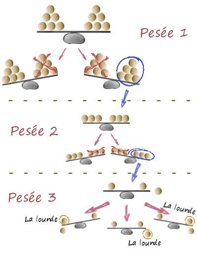

On a 12 billes de billard dont l’une est soit plus lourde soit plus légère que les 11 autres. Il s’agit de la trouver à l’aide d’une balance à fléau (qui compare le poids des boules placées sur ses deux plateaux) en 3 pesées maximum.

Voici une méthode mathématiquement rigoureuse permettant de résoudre ce problème et d'autres du même type

#### Solution Générale

Chaque pesée peut donner 3 résultats : équilibré (noté 0), penche à gauche (noté 1) ou penche à droite (note 2)

Comme on a 3 pesées, le résultat des 3 pesées peut être noté en ternaire (base 3) par un nombre à 3 chiffres : par exemple "201" signifie : 1ère pesée penche à droite, seconde équilibrée, troisième à gauche.

Entre parenthèses, l’information contenue dans ce nombre est suffisante pour que l’on puisse distinguer à la fois quelle boule est truquée et dans quel sens : en effet il y a 3^3=27 combinaisons de pesées possible alors qu’il y a 12\*2=24 possibilités de solutions.

Il suffit donc de "coder" les 12 balles par deux nombres en base 3, l’un donnant la séquence de pesée correspondant si la balle en question est trop lourde, l’autre la séquence correspondant à une bille trop légère. Evidemment, ces deux nombres en ternaire doivent êtres tels que les 1 du premier nombre sont des 2 dans le second et vice versa. De plus, il faut veiller à ce que le nombre de "1" dans chaque colonne des nombres ternaires corrresponde au nombre de "2". Voici un codage possible :

```
bille        1   2   3   4   5   6   7   8   9  10  11  12
trop lourde 001 010 011 012 100 101 102 220 222 221 210 122
trop legere 002 020 022 021 200 202 201 110 111 112 120 211
```

En lisant la table, on détermine les 3 pesées à effectuer de la manière suivante : si le chiffre correspondant du code "trop lourde" est un 1, la bille est placée à gauche, si c’est un 2 elle est placée à droite, si c’est un 0 elle n’est pas présente dans la pesée :

```
pesée	à gauche	à droite
1	5+6+7+12	8+9+10+11
2	2+3+4+11	8+9+10+12
3	1+3+6+10	4+7+9+12
```

#### Exemple

Si vous ne croyez pas la démonstration ci-dessus, il ne reste plus qu’à vérifier de la manière suivante. par exemple :

Si la bille 10 est trop légère, alors en consultant la table des pesées on voit que la balance penchera à gauche à la première pesée, à gauche à la seconde et à droite à la troisième, ce qui donne "112". En regardant la table des codes on voit que "112" correspond effectivement à "bille 10 trop légère".

Si les trois pesées penchent successivement à droite, puis à gauche, puis est équilibrée (code 210), on voit dans la table des codes que ça correspond à "bille 11 trop lourde". En consultant la table des pesées, on voit que la bille 11 est effectivement à droite à la première pesée, à gauche à la seconde et n’apparaît pas à la troisième.

Pour voir si vous avez compris, montrez qu’avec 5 pesées on peut trouver une bille truquée parmi 39...

_publié lundi 21 juin 1999 dans le journal interne de Charmilles Technologies_
