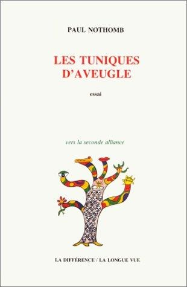

J’ai failli me convertir au judaïsme après avoir lu cette merveille, mais à la réflexion il doit y avoir pas mal de juifs qui ne partagent pas la vision ouverte et progressiste que Paul Nothomb propose de l’homme en traduisant la Genèse directement de l’hébreu. Alors je suis resté agnostique mais persuadé que "les tuniques d’aveugle" décrivent bien mieux la condition humaine que les "peaux de bêtes" qu’Adam et Eve revêtirent dans le catéchisme de mon enfance.

Ce qui m’a particulièrement plu, c’est l’attention scrpuleuse portée à la Genèse, texte souvent considéré comme une fable au premier degré. Dans toutes les religions, le texte de la création situe l’homme par rapport à la divinité et est donc fondamental, trop fondamental pour qu’on puisse se permettre d’utiliser une traduction de traduction de traduction pour l’enseigner.

Lisez ce bouquin que vous soyez croyant ou pas, vous ne verrez plus la Bible de la même façon.


