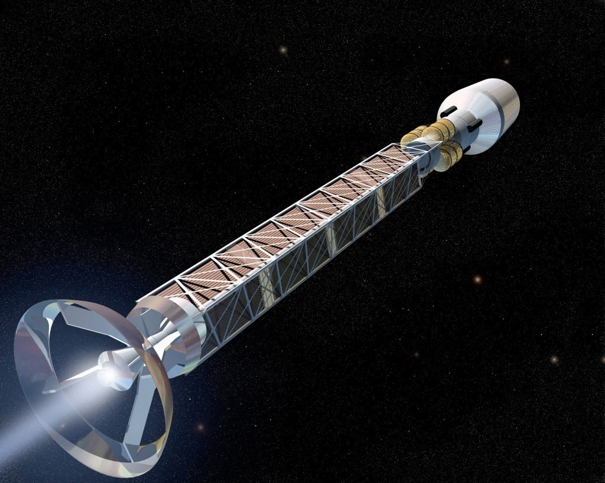

Ce petit texte est basé sur un calcul (faux\*) fait [sur un tableur](https://accounts.google.com/ServiceLogin?service=wise&passive=1209600&continue=https%3A%2F%2Fspreadsheets.google.com%2Fccc%3Fkey%3Drc4P1ifhL9e6cFJec1T6m5g%26hl%3Den%26pref%3D2&followup=https%3A%2F%2Fspreadsheets.google.com%2Fccc%3Fkey%3Drc4P1ifhL9e6cFJec1T6m5g%26hl%3Den%26pref%3D2&hl=en) : un vaisseau spatial accélère à 1G (9.81 m/s^2) de manière à créer une gravité artificielle. La vitesse augmente ainsi de manière constante jusqu’à approcher de très près la vitesse de la lumière. Arrivé à mi-parcours, le vaisseau se retourne et freine à 1G jusqu’à destination.

- 12 février 2022, Jour 0 : Après des semaines passées à tourner dans la station orbitale en gravité réduite, nous sommes contents de retrouver notre poids normal. Le vaisseau a démarré comme prévu, et ses moteurs nous accélèrent à 9.81 m/s^2, 1G, l’accélération gravitationnelle de cette bonne vieille Terre dont nous nous éloignerons plus loin qu’aucun autre avant nous, plus loin que l’imagination la plus folle ne peut nous porter.
- 13 février, Jour 1 : Le départ date d’un jour exactement. La douce accélération terrestre nous propulse à 848 km/s actuellement, et ce chiffre augmente chaque minute sur l’écran de contrôle. Nous saisissons chaque occasion de communiquer avec la Terre, car nous savons que ce privilège ne nous sera pas accordé bien longtemps.
- 16 février, Jour 4 : nous avons atteint 1% de la vitesse de la lumière. Jamais aucun objet construit par l’homme n’a été aussi rapide. Et l’accélération est loin d’être terminée.
- 12 mars, Jour 28 : un mois que nous sommes partis. Nous avons déjà parcouru 30 milliards de kilomètres. Nos messages mettent 100’000 secondes, soit plus d’un jour à atteindre la Terre, et autant pour que la réponse nous revienne. Autant dire que nous ne pouvons compter que sur nous mêmes désormais...
- 20 mars, Jour 36 : 10% de la vitesse de la lumière. Aucun moyen de réaliser que nous naviguons cette vitesse inimaginable car nous manquons de points de repère. Frank, l’ingénieur propulsion est tout excité et nous promet que son moteur n’a pas pris une ride depuis notre départ, et qu’il nous amènera jusqu’aux étoiles...
- 3 avril, jour 50 : deux "événements numériques", comme nous les appelons à bord, à quelques heures d’intervalle : nous avons parcouru un centième d’année-lumière depuis notre départ, et le facteur Lorenz est passé à 1.01, ce qui signifie que le temps a ralenti de 1% pour nous par rapport à la Terre. Einstein est désormais notre passager clandestin.
- 14 mai, jour 90’ : nous avons passé 90 jours dans le vaisseau, et notre calendrier indique le 13 mai, mais sur Terre, 91 jours se sont écoulés et nos congénères vivent le 15 mai. Nous adoptons le "prime" pour différencier les vitesses et temps locaux du vaisseaux de ceux de la Terre. Nous avons atteint 25% de la vitesse de la lumière. Il y a plus d’un mois que nous ne recevons plus de messages de la Terre : s’ils obstinent à nous en envoyer, leur infinitésimale puissance est noyée par les parasites créés par notre moteur qui chuinte à peine en dégageant le torrent d’énergie qui nous accélère toujours et encore plus vite....
- 28 juillet, jour 161’ : nous avons parcouru notre premier dixième d’année-lumière en 5 mois. Depuis une semaine le Lorenz est à 1.1 : le temps a beau s’écouler 10% plus vite que sur Terre, il nous semble toujours s’écouler trop lentement.
- 26 août, jour 186’ : Rien de spécial, sauf que nous avons dépassé aujourd’hui la moitié de la vitesse de la lumière !
- 21 septembre, jour 208’ Le facteur Lorenz est passé de 1.1 à 1.2 en 47 jours seulement. La Terre a vécu presque 2 semaines de plus que nous.
- 14 octobre, jour 227’ 0.2 années-lumière parcourus : nous sortons à peine de la banlieue du Système Solaire. La probabilité de heurter un minuscule caillou s’abaisse. On s’habitue à l’idée d’une collision lorsqu’on réalise qu’elle libérerait plus d’énergie que la plus puissante bombe thermonucléaire. On se rassure en se disant que notre passage de l’état vivant à l’état de plasma ionisé serait si rapide que la douleur ne parcourait qu’un centimètre dans nos nerfs, n’atteignant jamais notre cerveau...
- jour 246’, facteur Lorenz 1.3 atteint. Nous avons vécu 23 jours de moins que nos familles restées sur Terre. Nous avons enclenché la modulation du moteur, qui permet d’utiliser le jet de particules émis pour transmettre des messages à faible débit vers la Terre. Ils les recevront dans 3 mois, si leurs instruments sont assez sensibles...
- Jour 298’, facteur Lorenz 1.5. les étoiles se colorent très légèrement en bleu par les hublots avant, en rougissent vers l’arrière.
- 12 février 2023, Jour 314’. Nos amis terriens fêtent l’anniversaire de notre départ, alors que nous déboucherons le Champagne dans 51 jours seulement.
- Jour 354’ . A dix jours de notre année de vol, nous fêtons un événement fantastique : le franchissement apparent de la vitesse de la lumière ! En effet, comme le facteur Lorenz (1.85) comprime notre temps, nous parcourons 300’000 km à chaque seconde de notre chrono de bord, alors que notre vitesse mesurée par un observateur extérieur ne serait "que" de 84% de la vitesse de la lumière.
- Jour 359’. Une demi-année-lumière franchie en moins d’un an "prime"... Le facteur Lorenz à 1.9 va commencer à rendre le voyage intéressant.
- Jour 365’ Champagne ! Un an que nous avons enclenché les moteurs... Nous fonçons dans le vide interstellaire à 86% de la vitesse de la lumière, à 0.7 année-lumière de notre planète. Et le temps est comprimé d’un facteur presque 2 : la Terre vit le 13 mai 2023, soit trois mois "en avance" sur la date figurant au calendrier du vaisseau.
- Jour 371’. Facteur Lorenz 2. La Terre vit deux jours pour chaque jour que nous passons dans ce vaisseau. Inimaginable !
- Jour 396’. Nous avons atteint 90% de la vitesse de la lumière.
- Jour 427’. Le 5 octobre 2023 restera dans les dates de l’Histoire celle qui a vu un vaisseau humain franchir une année-lumière !!! 600 jours se sont écoulés sur Terre, nous n’avons vieilli que de 14 mois.
- Jour 436’. 94% de la vitesse de la lumière. Facteur Lorenz 3. Il n’y a que deux mois que le facteur est passé à 2... Einstein n’est plus un passager clandestin, mais un membre de l’équipage qui nous fait des farces à chaque instant. La Terre a déjà vécu 6 mois de plus que nous...
- Jour 466’ 97% de c, un seul mois pour passer le Lorenz de 3 à 4... Et, coïncidence, la Terre fête le deuxième anniversaire de notre départ, 264 jours en avance sur nous...
- Jour 484’. 98% de la vitesse de la lumière. Facteur Lorenz 5...
- Jour 493’, La Terre a une année de plus que nous.
- Jour 505’, Nous avons atteint 99% de la vitesse de la lumière "deux neufs" selon le jargon du bord
- Jour 510’, nous avons parcouru une deuxième année-lumière en 3 mois "prime" seulement grâce à un facteur Lorenz qui vaut aujourd’hui 7.9. Bien sur, sur la Terre, un peu plus d’une année s’est écoulée depuis le 5 octobre 2023. Ils sont aujourd’hui le 14 octobre 2024.
- Jour 539’, nous avons parcouru une troisième année-lumière en 1 seul mois "prime" seulement grâce à un facteur Lorenz qui vaut aujourd’hui 23 !. La vitesse est de "trois neufs" : 99.9% de c. Sur la Terre, c’est le 28 octobre 2025.
- Jour 548’, 1 année-lumière franchie en 12 jours seulement ! La vitesse est de "quatre neufs" : 99.99% de c. Le facteur Lorenz est proche de 60 : Deux mois s’écoulent sur Terre chaque jour "prime".
- Jour 551’, 1 année-lumière de plus franchie en 3 jours seulement grâce à un Lorenz à plus de 100, augmentant chaque minute, "cinq neufs", nous avons atteint la vitesse de particules à accélérées au CERN ! Mais surtout, nous avons enfin parcouru la moitié de la distance qui nous sépare de notre destination : l’étoile de Barnard, l’étoile de type solaire la plus proche du Soleil.

Il est donc temps de passer à la phase de freinage. Nous coupons le moteur, jouissons de quelques heures d’apesanteur pendant que le vaisseau se retourne sur sa trajectoire, puis relançons notre fidèle moteur qui va dorénavant nous freiner à 1G, en nous restituant l’agréable gravité à laquelle nous sommes habitués. La deuxième moitié du voyage sera donc la symétrie exacte de la première.

- Jour 1102’ Moins de 3 ans après notre départ, nous nous mettons en orbite autour de Barnard, distant de 10 années lumière du Soleil. Les 7 ans que nous avons "gagné" ont un prix : près de 11 ans se sont écoulés sur Terre. Lorsque nous rentrerons après notre mission de 3 ans ici, nous retrouverons nos proches vieillis de 25 ans alors que nous aurons vécu une incroyable aventure de 9 ans "seulement".

Je ne peux m'empêcher de penser que nous aurions pu parcourir des dizaines d'années lumières de plus en accélérant encore pendant quelques jours "prime". En fait nous aurions pu traverser toute la Voie Lactée, parcourir peut être 20'000 années-lumière en un mois de notre vie. Peut-être coloniserons-nous l'Univers ainsi ? Peut-être sommes-nous même condamnés à le faire en vertu du Principe de Saturation Cubique...

* * *

note\*(edit du 9.2.18) malheureusement ce calcul est faux. Les bonnes formules se trouvent [sur la wikipedia](https://en.wikipedia.org/wiki/Space_travel_using_constant_acceleration) et dans le commentaire de Jean Bossaert ci-dessous. je vais soit modifier ce texte (mais il ne sera plus aussi spectaculaire...) soit en écrire une version "intergalactique" ...

_copyright 2004 Philippe Guglielmetti, tous droits réservés. Il est interdit de copier ou de diffuser ce texte sans autorisation_
