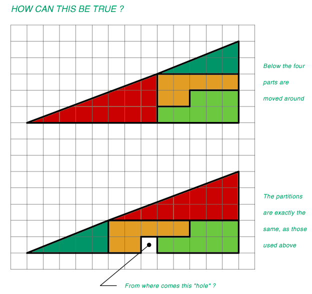

<!--more-->

Si on regarde bien, le triangle vert à une pente différente du rouge : Le vert monte de 2 carrés pour 5 horizontalement, le rouge de 3 pour 8, et 2/5 est bien différent de 3/8.

Conc les deux figures ne sont pas des triangles parfaits : l’hypoténuse de celui sans trou est légèrement concave, celle de celui avec trou fait une bosse, et si on fait le calcul de la surface ainsi récupérée en grignotant l’hypoténuse, on risque bien de trouver la surface du trou.

En effet :

1. la surface du grand triangle a l’air (si il était parfait) d’être de 5x13/2 = 32.5 carrés
2. la surface des pièces est 5 (triangle vert) + 12 (triangle rouge) + 8 (vert clair) + 7 (orange) = 32

Il reste à montrer que la surface du triangle tout fin qu’il faut une fois ajouter et une fois enlever à l’hypoténuse vaut 0.5 carrés... A vos calculettes !

Il y a pas mal de variantes de ce casse-tête, au chalet j’ai une boite que l’on peut remplir "parfaitement" avec des petits plots de 2 manières différentes, mais dans un cas il reste un petit plot qu’on ne peut pas placer à moins de le réduire en fine sciure...
