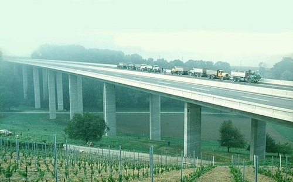
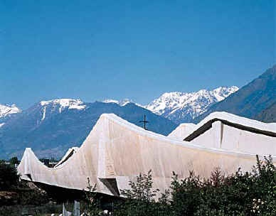
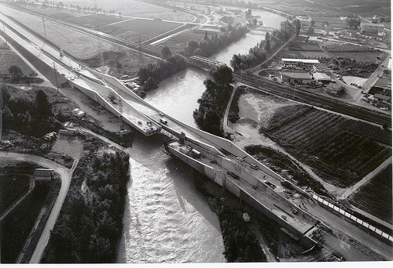
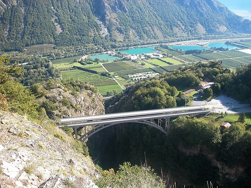
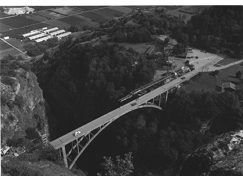
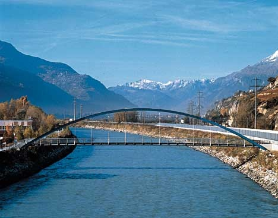

Cette page est réalisée à partir de documents que mon papa Umberto m’a demandé de transmettre à un jeune garçon de 12 ans déjà passionné par le Génie Civil. Comme je n’avais pas ces documents moi même, je les ai digitalisés pour les conserver et je les publie ici pour susciter éventuellement d’autres vocations.

### Pont sur le Talent

- 1977-1979
- Pont sur le Talent de l’autoroute N1 Lausanne-Yverdon à Chavornay
- Réalisé à la suite d’un concours + soumission.

#### Caractéristiques

- Ponts poutre jumelles en béton armé à précontrainte longitudinale et transversale
- Longeur totale : 384.20 m
- Portées 22.50 à 46.90m
- Largeur des tabliers à caisson : 12.70 m
- Hauteur des piles : 10.00 m à 36.00 m
- Fondations profondes en puits prenant appui sur la molasse
- Participants :
    - Entreprise Walo Bertschniger, Lausanne
    - Benno Bernardi ing., Zürich
    - Carroz & Küng ing., Payerne
- Coût : CHF 6’552’000.-

### Route transversale Charrat-Fully

- 1977-1978
- Pont sur l’Autoroute N9

#### Caractéristiques

- Pont cadre à béquilles obliques en V en béton armé et précontraint
- Longeur totale : 104.00 m
- Largeur du tablier - dalle évidée : 11.40 m
- Fondations profondes sur pieux-barettes
- Coût : CHF 808’000.-

#### Documents

- [Fiche Bureau Gianadda & Guglielmetti avec photo et plan](https://drgoulu.files.wordpress.com/2007/03/n9charrat.pdf "Fiche Bureau Gianadda & Guglielmetti avec photo et plan")

### Viaduc du chemin de fer aux Trapistes

- 1977
- Pont du chemin de fer Martigny-Orsières sur la Dranse et la route A114 dans la région des Trapistes

#### Caractéristiques

- Pont type CFF, courbe en biais en béton armé et précontraint
- Longeur totale : 141.00 m
- Travées 34.0 + 36.5 + 36.5 + 34.0 m
- Largeur du tablier de type ballasté à caisson : 6.20 m
- Fondations superficielles
- Coût : CHF 802’000.-

### Ponts de Riddes

Cet ouvrage se situe à Riddes, à mi-chemin de Martigny et de Sion. Il s'agit de deux ponts identiques et parallèles, décalés de 21.30 m du fait de la traversée en biais du lit du fleuve. La longeur totale de chaque ouvrage est de 253 m, dont 143 m pour la travée centrale. L'orignalité du projet tient au fait qu'il s'agit d'une ''structure renversée''. Cette disposition ''en auge'' offre les avantages suivants: la chaussée est le plus bas possible et n'entraîne donc pas de surélévation de de l'autoroute et les poutres latérales constituent des écrans antibruit

#### Caractéristiques :

- Ouvrages complexes de formes spéciales réalisés à la suite d’un concours
- Tabliers poutres continues en forme d’auge d’inertie variable en béton armé
- Précontrainte longitudinale et transversale
- Fondations profondes sur pieux moulés de grand diamètre
- Construction en encorbellement
- Longueur totale : 253.00 m
- Portées : 55.00 + 143.00 + 55.00 m
- Largeur des tabliers : 2 x 12.00 m
- Effectif engagé : 35 personnes
- Montant des travaux : CHF 18'000'000.-
- Durée des travaux : 1985 - 1988 (40 mois) Palplanches : 3'000 m2 Coffrage : 26'000 m2 Terrassement : 5'000 m3 Béton : 9'000 m3 Pieux Forés : 1'200 m Aciers : 1'000 to

#### Références :

- Guglielmetti, Umberto "[Ponts sur le Rhône à Riddes, Suisse](/wp-content/uploads/2005/07/bse-re-003_1991_64_a_005_d-1.pdf)",Bridges — Interaction between construction technology and design, IABSE Symposium, Leningrad, USSR 1991
-   pp. 468
- [Guide des ponts de l’EPFL](http://dgcwww.epfl.ch/guide_des_ponts/valais/riddes.htm) [(format PDF)](http://drgoulu.files.wordpress.com/2007/03/riddesepfl.pdf "fichier PDF")
- [“Ponts de Riddes”, brochure 12 pages en couleur du service des routes nationales](http://drgoulu.files.wordpress.com/2007/03/n9riddes.pdf "“Ponts de Riddes”, brochure 12 pages en couleur du service des routes nationales")
- [fiche entreprise Evequoz](http://www.evequoz.ch/_assets/000/050/005/686/a1734071de764362824c59995ed3a373.pdf)
- [fiche Structurae](http://structurae.info/ouvrages/pont-de-riddes)

### Viaducs "Bois-Homogène"

- 1987-1988
- Double viaduc de l’autoroute N9 près de St.Maurice, par dessus le terrain de l’entreprise "Bois-Homogene"

#### Caractéristiques :

- Ponts dalle continue en béton armé à précontrainte longitudinale et transversale.
- Longueur totale : 265.60 m
- Portées 29.50 m
- Largeurs du tablier variables de 12.0 à 15.0 m
- Fondations profondes sur pieux moulés D 120 cm faisant suite aux piles
- Réalisation en collaboration avec le bureau ATIB SA, Martigny
- Coût : CHF 4’500’000.-

### Nouveau pont du Gueuroz

- 1993-1994
- Pont route mixte sur les gorges du Trient en remplacement du pont existant sur la route 102 Martigny-Salvan

#### Caractéristiques :

- Cadre métallique à béquilles obliques en acier patinable.
- Mode de montage spécial par poussage du tablier depuis la rive droite sur béquilles préalablement inclinées et retenues par un harnais.
- Dalle tablier en béton armé et précontraint bétonnée par étapes au moyen d’un chariot mobile roulant sur la charpente métallique
- Longueur totale : 178.00 m
- Portée principale 106.00 m
- Largeurs du tablier 8.0 m
- Coût : CHF 3’965’000.-

#### Documents:

- [http://www.isatis.ch/gueuroz/gueuroz2.html](http://www.isatis.ch/gueuroz/gueuroz2.html)
- ["Le pont neuf des gorges du Trient", François Besson, Journal de la Construction No14, décembre 1993, pages 23-27](http://drgoulu.files.wordpress.com/2007/03/gueroz-art1.pdf)
- ["La restauration du pont routier de Gueuroz sur la gorge du Trient", Jacques Gubler, Ingénieurs et architectes suisses No 7 mars 1991, pages 64 à 71](http://drgoulu.files.wordpress.com/2007/03/gueroz-art2.pdf)

### Passerelle piétons à Granges

- 1995

#### Documents

- [Passerelle piétons à la gare de Granges Article d’Umberto Guglielmetti, "strasse und verkehr" Nr 12, décembre 1996, pages 637-640 + plan général](http://drgoulu.files.wordpress.com/2007/03/passgranges.pdf)
