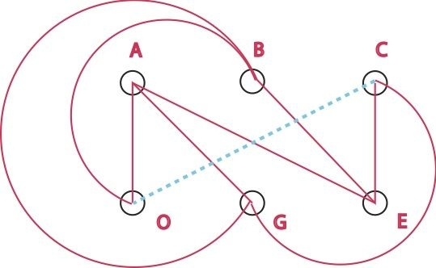

Comment amener l’eau, le gaz et l’électricité depuis les 3 usines correspondantes vers 3 maisons sans que les tuyaux et câbles correspondants ne se croisent sur un plan ?

C’est le genre de casse-tête qui m’énerve, surtout si on me dit qu’il existe une solution.

En fait, il n’y a pas de solution à ce problème. Mon collègue [Dr. Math le prouve de 2 manières différentes](http://mathforum.org/dr.math/faq/faq.3utilities.html) , et montre qu’un planète torique offrirait des avantages ...
