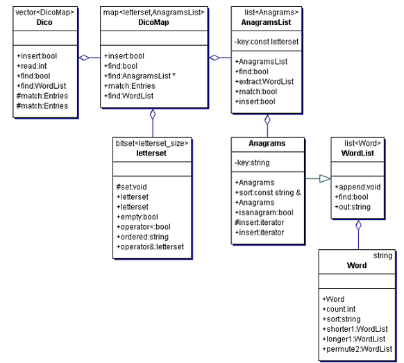

DicoLib est une librairie C++/STL pour les jeux de mots, que j'ai développé initialement pour résoudre le casse-tête "[word-downsizing](http://drgoulu.local/2005/09/14/word-downsizing/)"

#### Complexité

L’algorithme "force brute" pour résoudre "[word-downsizing](http://drgoulu.local/2005/09/14/word-downsizing/)" consiste à chercher les n mots de 8 lettres du dictionnaire (O(N)), puis pour chacun d’eux, enlever successivement chaque lettre et vérifier s’il est présent dans le dictionnaire (O(N.log N) pour liste triée), et recommencer s’il y est. La complexité est environ O(N+n.100.N.log N). Le facteur 100 est une estimation du nombre de recherches dans le dictionnaire pour chaque mot avant d’arriver à une impasse. Avec typiquement N=30’000 et n=5’000, on se retrouve avec _'240 milliards de comparaisons_' de chaînes de caractères à effectuer si l’on veut trouver toutes les solutions. Compter une petite heure...

On pourrait se satisfaire de ceci et se demander pourquoi passer des heures à programmer une solution plus futée. Et bien, si on est capable de retrouver rapidement les mots qui ne se distinguent d’un autre que par une seule lettre, ou deux ou trois, on obtient un correcteur d’orthographe rapide et efficace. Mais pour une telle application, la complexité mentionnée ci-dessus serait inacceptable.

#### Conception

Comment accélérer très sérieusement la recherche de mots "semblables" a un autre dans un dictionnaire ?

Quelques idées :

- grouper les mots par tailles. Si on cherche un mot de 6 lettres, on ne le cherchera que parmi ceux-là.
- construire une "signature" du mot sous la forme d’un ensemble de 26 bits indiquant quelles lettres sont présentes dans le mot, et grouper les mots ayant la même signature (donc composés des mêmes lettres) dans une liste. 26 bits, c’est moins que 32, donc très pratique à manipuler par le processeur pour des opérations logiques. Mais c’est trop pour être utilisé comme clé dans une table de hachage, qui aurait dans les 64 millions d’entrées.

Je me suis dont mis à réfléchir à une structure de donnée permettant de stocker un dictionnaire de mots sous une forme permettant la recherche rapide de mots similaires (avec une lettre en plus ou en moins), des anagrammes (mots obtenus par permutation des lettres) ou selon les lettres qui les composent (pour le scrabble).

J’ai alors eu une idée simple, dont je ne sais pas encore si elle est originale, mais en tout cas elle est très efficace, et j’ai écrit un ensemble de classes C++ "Dico.lib",une librairie permettant de réaliser en quelques lignes des programmes de résolution de divers jeux de lettres.

L’idée principale de DicoLib est de stocker les mots dans une structure permettant d’y accéder rapidement sur la base de 2 informations simples :

- la longueur du mot
- une clé de 26 bits (letterset) codant la présence de chaque lettre de l’alphabet dans le mot. par exemple le mot "alphabet" donne

```
11001001000100000001000000
abcdefghijklmnopqrstuvwxyz
```

#### Structure de données

[](http://drgoulu.local//HLIC/1ade4c51414f00bed19e3f143a4bc6b4.png)

dico.lib définit la hiérarchie de classes suivantes :

- class Word // mots du dictionnaire
- class letterset : public std ::bitset<26> // clé d’accès
- class WordList : public std ::list // liste de mots
- class Anagrams : public WordList // liste d’anagrammes
- class AnagramsList : public list // liste de listes d’anagrammes
- class SameLetters : public vector // mots formés des même lettres, organiséss par longueurr
- class Dico : public std ::map // dictionnaire utilisant les letterset comme clé primaire

#### Liens

- [projet DicoLib sur SourceForge](http://sourceforge.net/projects/dicolib), d'où vous pouvez télécharger le code et contribuer à le développer
- [an efficient C++/STL library for word puzzles and spell checking](http://www.codeproject.com/KB/cpp/DicoLib.aspx), article sur [http://www.codeproject.com](http://www.codeproject.com)
- des dictionnaire en mode texte sont disponibles ici:
    - [le Petit Larousse Illustré et l'Officiel du Scrabble](http://ledefi.pagesperso-orange.fr/Dictionnaires.htm)
