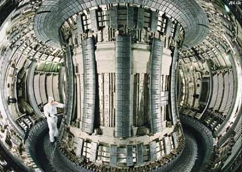

pourquoi il ne faut pas trop compter sur cette "source inépuisable d'énergie abondante, bon marché et non-polluante"

### La [fusion thermonucléaire](https://fr.wikipedia.org/wiki/fusion_thermonucléaire) ? c'est quoi ?

C'est ce qui fait briller les étoiles : aux pressions et températures extrêmes qui règnent au centre des étoiles, les atomes légers peuvent fusionner en atomes plus lourds, en dégageant beaucoup d'énergie.

Cette réaction fait également produire de la matière aux étoiles, convertissent ainsi peu à peu l'hydrogène qui constitue encore 98% des atomes de l'Univers en helium, qui en constitue 1%. Lorsqu'une étoile est trop "polluée" par de l'hélium, la réaction s'arrête, l'étoile s'effondre sur elle-même, et, si elle est assez massive, se chauffe suffisamment pour faire démarrer une fusion de l'hélium et ainsi de suite, en produisant, l'azote, le carbone, l'oxyogène etc.

La machine s'arrête avec le fer, qui est l'atome le plus "stable" : fusionner du fer ne produit pas d'énergie, mais en consomme. C'est ainsi que les atomes encore plus lourds comme l'uranium qui sont formés par accident "contiennent de l'énergie solaire" qui sera restituée lorsque ces atomes se casseront par la fission nucléaire exploitée dans les centrales nucléaires "classiques", ce qui n'a donc rien de commun avec la fusion.

### Et sur Terre ?

La fission nucléaire a été comprise dans les années 1930, utilisée dans la bombe A d'Hirsohima en 1945 et exploitée de manière "civile" pour la production d'énergie dès les années 1950. La fusion a été prévue par Andreï Sakharov et Ilia Frank dans les années 1940. Sakharov a ensuite mis au point la terrible bombe H dès 1952 avant de devenir dissident et Prix Nobel de la Paix.

La bombe H est en fait une bombe A "à charge creuse" dont l'explosion est concentrée sur un peu d'hydrogène (plutôt du deuterium comme on le verra plus loin). L'hydrogène est alors tellement comprimé et chauffé qu'il fusionne, multipliant par plus de 100 la puissance de la bombe A.

Au chalet nous avons un petit livre sur la fusion thermonucléaire datant des années 60 dont l'introduction dit en gros : dans 30 ans (donc en 1990...), la fusion thermonucléaire fournira la planète en électricité. Depuis 50 ans des milliers de physiciens essaient désespérément de faire produire un peu d'électricité par fusion, alors qu'il avait suffi de 10 pour passer de la bombe A à la centrale nucléaire à fission.

### Pourquoi ça ne marche pas ?

"Fusionner des atomes", c'est en fait fusionner les noyaux des atomes, et les noyaux d'hydrogène sont en fait composés d'un seul proton. Un proton c'est:

1. une petite masse
2. minuscule
3. chargé électriquement positivement

Pour en faire fusionner 2, il faut qu'ils se télescopent assez violemment, et c'est difficile parce que:

1. comme les deux ont la même charge (+), ils se repoussent l'un l'autre, donc il faut les catapulter l'un vers l'autre avec une vitesse assez grande pour que l'énergie de répulsion soit moins forte que l'énergie cinétique des noyaux
2. comme ils sont tout petits, il faut "bien viser" : si les deux atomes ne sont pas en collision frontale, leur charge les fera s'écarter.

Dans les étoiles, la recette est la suivante:

1. on met énormément d'atomes dans un petit volume grâce à une pression colossale
2. on chauffe un petit peu (quelques millions de degrés suffisent...) pour que les noyaux aient une bonne énergie cinétique
3. si une collision échoue, ce n'est pas grave car la probabilité qu'une collision se produise après reste très élevée.

Sur Terre, le problème est qu'$ part dans une bombe atomique, on arrive pas à créer une pression approchant le millième de celle qui règne au centre d'une étoile, donc:

1. on doit chauffer beaucoup plus pour que les noyaux aient une vitesse encore plus élevée et ainsi obtenir la même probabilité de collision que dans une étoile
2. on doit faire en sorte que ces particules beaucoup plus rapides restent dans une zone ou elles ont une forte probabilité de collision.

### Deutérium et Tritium

En fait on est obliger de "tricher" pour avoir une petite chance d'espérer : on n'utilise pas de l'hydrogène "simple" mais du deutérium qui est un isotope de l'hydrogène avec un neutron collé au proton, ce qui double la masse des noyaux à fusionner, donc double l'énergie cinétique des noyaux en gardant la même répulsion électrique, ce qui permet de moins chauffer. Le deutérium représente environ 2% de l'hydrogène présent sur Terre, donc en quantité quasi-infinie dans les océans, mais il faut quand même l'extraire et ce n'est pas trivial.

Par désespoir on en est même venus à vouloir utiliser du tritium, isotope de l'hydrogène doté de 2 neutrons, mais cet élément très rare et instable doit être "fabriqué" lors d'une réaction qui émet des neutrons. On s'éloigne donc encore plus du principe de l'"énergie des étoiles". Dans le paragraphe "Helium 3" ci-dessous j'explore une alternative osée à cette approche.

### Confinement

Dans une étoile flottant librement dans l'espace, la zone de fusion est de forme sphérique et entourée par des milliers de kilomètres de gaz qui servent à la fois de combustible, d'enceinte à pression et d'isolant thermique, puisque la surface du soleil n'est qu'à 5000° environ.

Sur Terre il faut créer un "isolant" capable de maintenir un plasma de gaz à plusieurs millions de degrés, si possible sous "pression", à quelques mètres de matériaux qui n'en supportent pas plus de quelques centaines. Il faut accessoirement chauffer ce plasma jusqu'à ce que la réaction s'amorce sans pouvoir rien "tremper" dedans, et trouver un moyen de faire revenir dans la zone de fusion des noyaux rapides qui ne pensent qu'à s'en écarter...

Les "tokamaks" actuels et le futur ITER confinent le plasma en forme de tore (="pneu") à l'aide de très puissants champs magnétiques dont les lignes de champ fermées permettent de satisfaire le cahier des charges ci-dessus, mais encore une fois de manière très différente de ce qui se passe dans les étoiles.

### Helium 3

Une réaction de fusion non-radioactive et qui se déroule à température moins élevée est He3 + D -> He4 + H

He3 est l'isotope 3 de l'hélium, qui a le léger défaut de n'être produit sur Terre qu'en très faible quantité (15 kg/an). Par contre, il existe4 sur la Lune en quantités énormes : il est produit dans la couronne solaire et transporté par le vent solaire, dévié par le champ magnétique terrestre, il n'arrive pas sur Terre, mais imbibe le sol lunaire.

Il est très possible que l'Helium3 soit non seulement la seule ressource naturelle intéressante de la Lune, mais que son exploitation commerciale puisse devenir une industrie aussi rentable que le pétrole, disons dans un siècle. Certaines entreprises se préparent déjà à la course.

### Conclusion

La fusion contrôlée est donc beaucoup plus complexe à mettre en œuvre que la fission, dans laquelle "yaka faire une bombe atomique qui pète lentement". De plus, alors qu'on dit souvent que la fusion est un "Soleil en laboratoire", propre, écologique etc, on va en fait vers l'utilisation d'une réaction différente de celle existant dans la nature, mise en oeuvre de manière très différente aussi. Les physiciens ne sont donc pas en train de reproduire un phénomène naturel existant, mais d'en inventer un complètement nouveau.

Ceci va vraisemblablement prendre beaucoup de temps, pour autant que ça réussisse. On parle aujourd'hui de 50 ans à un siècle avant que cette forme d'énergie soit exploitable commercialement. Il est très probable que ça ne sera pas prêt au moment de l'épuisement du pétrole, donc que l'humanité devra trouver autre chose entre la fin des énergies fossiles et le début de la fusion.

#### Références

- [Wikipedia : Fusion thermonucléaire](http://fr.wikipedia.org/wiki/Fusion_thermonucl%C3%A9aire)
- [http://www.univ-lemans.fr/enseignements/chimie/01/deug/CHIMDISCRI/fusion.html](http://ressources.univ-lemans.fr/AccesLibre/UM/Pedago/chimie/01/deug/CHIMDISCRI/fusion.html)
- [Projet Artemis pour exploiter le He3 lunaire](http://www.asi.org/adb/02/09/he3-intro.html)
