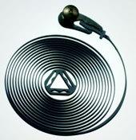

Le ressort spiral est utilisé en horlogerie pour entrainer le balancier dans un sens, puis dans l'autre le plus régulièrement possible. J'ai fait le petit raisonnement suivant suite à la demande d'un client qui me demandait de calculer un tel ressort, capable de s'enrouler sur un tour complet.

Un ressort spiral peut être calculé "à la main" assez facilement à l'aide des 2 formules suivantes:

1. M=E.b.e³/12.L
2. s=6.C/b.e²

L'équation 1 donne la raideur (en N.mm/rad) d'un spiral de section b x e et de longueur L réalisé dans un matériau d'élasticite E (MPa ou N/mm2). Elle est tirée de "[Théorie d'horlogerie](http://horlogerie.wordpress.com/2007/03/31/theorie-dhorlogerie/)" p 138 qui mentionne que le spiral "devrait compter de 12 à 15 tours"... Je pense que la raison en est la deuxième équation, tirée d' [ici](http://fr.wikibooks.org/wiki/Ressort#Ressort_spiral_.C3.A0_spires_nombreuses) et qui donne la contrainte sur le ressort de section b x e pour un couple C.

Si on fait un tour on a C = 2π\*M donc après simplification: s=π.E.e/L Or comme la limite d'élasticité des aciers vaut autour de 0.003.E, on peut dire qu'on doit avoir π.e/L < 0.003 soit e/L < 0.001 environ.

Autrement dit il faut "au pif" qu'un spiral en acier ait une longueur supérieure à 1000x l'épaisseur de la lame pour qu'il puisse s'enrouler sur un tour sans dépasser la limite élastique. En fait, un spiral d'horlogerie approche de sa limite élastique plusieurs fois par seconde pendant des années, c'est donc une pièce très critique...

Référence : \[openbook booknumber="ISBN:978-2940025107" templatenumber="5"\]
