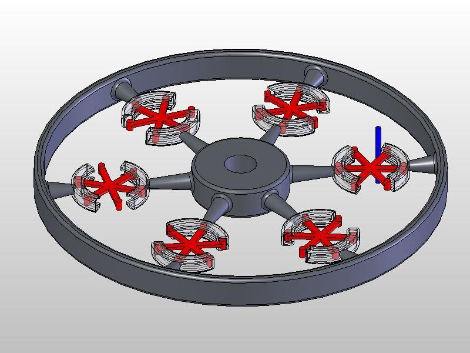
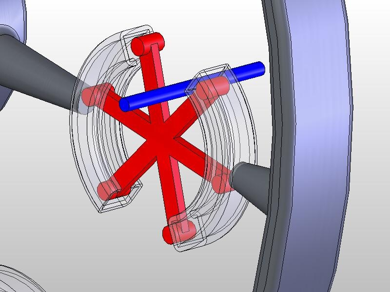
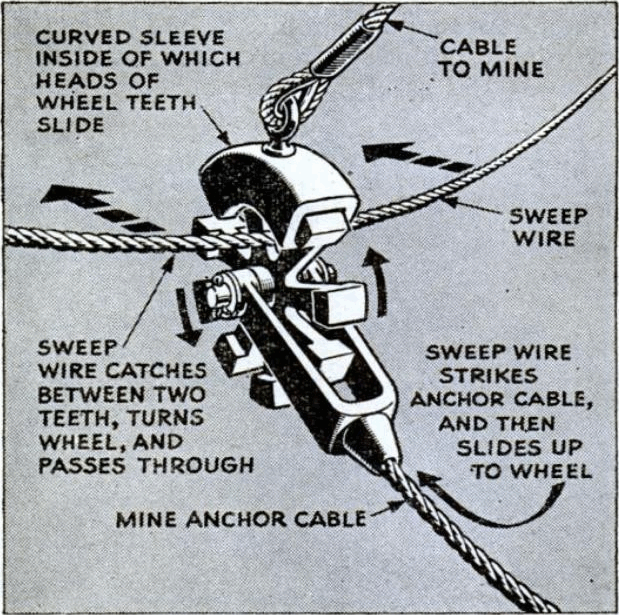

L' "éviteur d’axe" ("[Shaft Passer](w:en)" en anglais) décrit par Richard Feynman dans son livre "Vous voulez rire, Mr Feynman" est il réel, ou une blague de plus ?'

### Historique

Tiré du livre 

> A Francfort, un ingénieur en mécanique essayait toujours de concevoir des choses mais n’y arrivait jamais parfaitement. Une fois il a dessiné une boite pleine d’engrenages dont une était une grosse roue de 20 cm de diamètre munie de 6 rayons. Le gars dit tout excité "Alors, chef, qu’en dites-vous ?"
> 
> "Bien !" répond le chef. "Toute ce qu’il vous reste à faire c’est de mettre un éviteur d’axe sur chaque rayon pour que la roue puisse tourner !" Le gars avait mis un axe qui traversait les rayons !
> 
> Le chef a continue en disant que l’éviteur d’axe existait(J’ai cru qu’il plaisantait). Ca avait été inventé par les Allemands pendant la guerre pour empêcher les dragueurs de mines anglais de capturer les cables qui maintenaient les mines allemandes à une certaine profondeur sous l’eau. Avec ces "éviteurs d’axes" , les câbles allemands laissaient passer les câbles anglais à travers eux comme à travers un tourniquet. Donc il était possible de mettre des "éviteurs d’axes" sur chaque rayon.

### Modèle SolidWorks

Je me suis mis à concevoir ce mécanisme en 3D avec SolidWorks

Suite à une [discussion sur comp.cad.solidworks](http://compgroups.net/comp.cad.solidworks/ot-looking-for-info-on-axis-avoider-or-ca/172134), j'ai reçu l'image ci-dessous, tirée d'un vieux magazine (edit du 19.2.2015 : retrouvé la référence !!! [Devon Francis "Their war is not over", Popular Science Janvier 1946 p. 74](http://books.google.com/books?id=WCEDAAAAMBAJ&lpg=PP1&hl=fr&pg=PA74#v=onepage&q&f=true)) qui montre l'application originale:

### Analyse

L’utilisation de ce mécanisme pour laisser des câbles se croiser semple plus pratique que son application pour des machines demandant un peu de précision. Il est clair que les tolérances de fabrication et les frottements seront très difficiles à maîtriser en pratique.

De plus, le diamètre de l’axe qui peut traverser est nettement plus faible que celui de la roue. Donc la fin de l’histoire de Feynman prouve que le chef avait un peu d’expérience en ingéniereie mécanique :

> mais le chef ne pensait pas que les mécaniciens devaient se donner toute cette peine ; tout ce qu’il restait à faire au gars, c’était de trouver un moyen de faire passer l’axe ailleurs.

Si vous pensez breveter ce mécanisme après l’avoir vu ici, contactez-moi ou préparez-vous à être poursuivi en justice, parce que je l’ai publié le premier !
