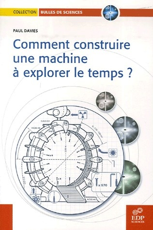

Dans ce livre [Paul Davies](https://fr.wikipedia.org/wiki/Paul_Davies_(physicien)) propose le schéma de principe d'un système permettant [le voyage dans le temps](https://fr.wikipedia.org/wiki/le_voyage_dans_le_temps) en créant un [trou de ver](https://fr.wikipedia.org/wiki/trou_de_ver):

1. un collisionneur crée un [plasma quark-gluon](https://fr.wikipedia.org/wiki/plasma_quark-gluon). Les accélérateurs d'ions lourds comme le [LHC](https://fr.wikipedia.org/wiki/Large_Hadron_Collider) du [CERN](https://fr.wikipedia.org/wiki/CERN) peuvent produire ces plasmas, à une température de 1013 [kelvin](https://fr.wikipedia.org/wiki/kelvin).
2. un « imploseur » comprimerait ensuite ce plasma par un facteur 1019 pour atteindre la [température de Planck](https://fr.wikipedia.org/wiki/température_de_Planck), ce qui formerait éventuellement un minuscule trou de ver. L'énergie nécessaire n'est pas élevée grâce au très faible volume, mais la technologie n'est pas disponible actuellement. Davis propose d'utiliser un dispositif [Z-pinch](https://fr.wikipedia.org/wiki/Z-pinch) amélioré, en le ceinturant d'une sphère de bombes thermonucléaires.
3. un « inflateur » est ensuite chargé d'agrandir le trou de ver par de l' "[énergie négative](https://fr.wikipedia.org/wiki/énergie_négative)", correspondant au niveau d'énergie que l'on trouve entre les plaques de l'[effet Casimir](https://fr.wikipedia.org/wiki/effet_Casimir). Paul Davies propose diverses idées liées à l'[énergie du vide](https://fr.wikipedia.org/wiki/énergie_du_vide) ou à l'[énergie sombre](https://fr.wikipedia.org/wiki/énergie_sombre), mais l'inflateur est certainement le composant le plus hypothétique de la machine…
4. le trou de ver étant créé, le « différentiateur » est chargé de créer une différence temporelle entre ses deux extrémités. On peut soit accélérer une extrémité A, chargée, à vitesse relativiste dans un accélérateur de particules, soit la placer dans le champ gravitationnel d'une [étoile à neutrons](https://fr.wikipedia.org/wiki/étoile_à_neutrons), pendant que l'extrémité B vieillit en même temps que les expérimentateurs, mettons pendant 10 ans.

En entrant dans l'extrémité B, et en ressortant en A, le voyageur remontera dans le temps de 10 ans, soit au moment de la création de la machine.

Une telle machine permet d'expliquer le "paradoxe de Hawking" selon lequel, si le voyage temporel était possible, nous aurions la visite de voyageurs temporels. En effet, la machine de Davies ne permet pas de remonter avant le moment de sa construction.

### Références :

- \[openbook booknumber="ISBN:978-0141005348" templatenumber="5"\]
- \[openbook booknumber="ISBN:978-2-86883-941-1" templatenumber="5"\]

_Mis à jour le 29/2/2012  : j'avais initialement ajouté ce texte à l'article sur le [Voyage dans le temps](https://fr.wikipedia.org/wiki/Voyage_dans_le_temps) dans la Wikipedia , il a ensuite été déplacé à l'article "[Comment construire une machine à explorer le temps](https://fr.wikipedia.org/wiki/Comment_construire_une_machine_à_explorer_le_temps)". Je viens de le reprendre avec les liens et en y ajoutant la référence claire aux livres_
