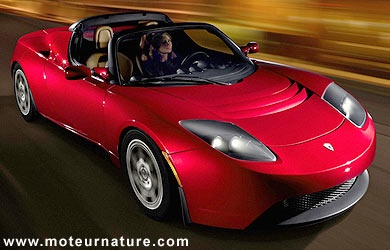
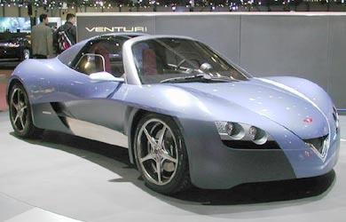

Les journaux ont parlé d'un futur bolide électrique accélérant de 0 à 100 en 4 secondes et doté d'une autonomie de 400 km : la [Tesla](http://www.teslamotors.com). Les 100 premiers exemplaires sont déjà vendus, et on peut réserver un exemplaire en versant 85% d'acompte sur le prix de $100'000...

La marque française [Venturi](http://www.venturi.fr) produit également depuis 2004 un roadster électrique, la "Fetish" aux performances similaires, mais pour un prix de €450'000...

- [article de MoteurNature.com sur la Tesla](http://www.moteurnature.com/actu/2006/tesla-electrique-roadster.php)
- [article de MoteurNature.com sur la Fetish](http://www.moteurnature.com/actu/2004/venturi_fetish.php)
