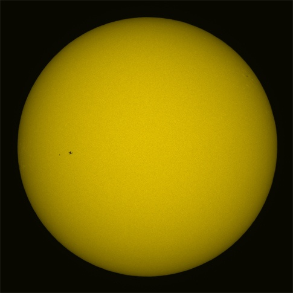
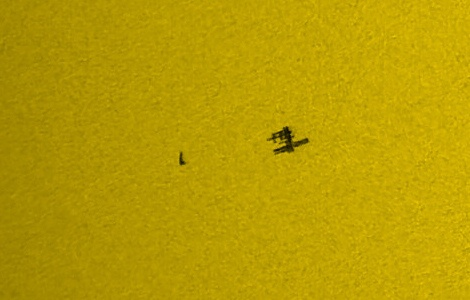

Sur le ["Bad Astronomy blog"](http://blogs.discovermagazine.com/badastronomy/) j'ai trouvé quelques fabuleuses photos astronomiques :

 Saturne éclairée en arrière plan par le Soleil ! (photo prise par la sonde Cassini)

en zoomant entre les anneaux, on découvre un petit point :

 la Terre vue à travers les anneaux de Saturne !

Et voici une photo du Soleil avec une petite tache, et un zoom sur la petite tache :

 

Les taches, ce sont la station spatiale ISS et la navette spatiale qui vient de s'en détacher !
