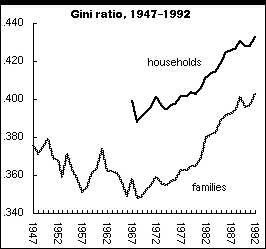

L'opinion générale relayée par les media nous le répète : les inégalités dans le monde s'accroissent, et c'est la faute de la libéralisation et de la mondialisation. Il faut avouer que c'est facile à croire, lorsque l'on observe la misère dans les villes et les campagnes du monde comparée à l'affolante fortune de certains.

Mais s'il y a des inégalités entre revenus facilement mesurables, existe-t-il une mesure de l'inégalité au niveau des pays ou du monde, que l'on puisse comparer année après année pour vérifier que les inégalités se creusent ?

Cette mesure existe, c'est le coefficient (ou indice) de Gini dont la définition est rigoureuse mais un peu mathématique (voir [ici si ça vous intéresse](w:Coefficient_de_Gini)). En bref, c'est une valeur qui vaut entre 0 et 1 (parfois noté en %)

- 0 dans une société "parfaitement égalitaire" où tout le monde aurait le même revenu
- 100% si une seule personne encaisse le revenu total de la société, et les autres rien du tout.

Sur l'excellent site [NationMaster (en anglais)](http://www.nationmaster.com/index.php), on trouve les indices de Gini de tous les pays [ici](http://www.nationmaster.com/red/graph/eco_dis_of_fam_inc_gin_ind-distribution-family-income-gini-index/AFR&b_desc=1). En particulier:

- les pays du nord de l'Europe (Danemark, Suède, Norvège, Finlande) et quelques autres pays européens (Hongrie, Slovaquie, ...) sont les pays les plus égalitaires, avec un Gini = 25 environ
- l'Allemagne suit à 28
- la France, l'Espagne et l'inde sont ex-aeco à 31, juste devant la Suisse et le Canada à 33.
- les USA sont entre l'Uruguay et la Côte d'Ivoire à 45, juste moins égalitaires que la Chine, 44 et nettement moins que la Russie, 40.
- les revenus les plus inégaux se trouvent en Amérique du Sud (Brésil, Bolivie et Chili autour de 60) et en Afrique : Sierra Leone, Botswana et Lesotho ferment la marche à 63, devant la dramatique Namibie, 70

Reste à savoir comment les indices de Gini évoluent au cours du temps. Ces infos ne sont pas facile à trouver, mais j'ai quand même mis la main sur quelques résultats :

- Pour les Etats-Unis, [cet article](http://www.leftbusinessobserver.com/Gini_supplement.html) fournit le graphique ci-contre, basé sur les données du "Census Bureau" américain. Il montre clairement que l'inégalité a effectivement fortement et régulièrement augmenté depuis 1970, alors qu'elle avait diminué presque jusqu'aux niveaux "européens" depuis la fin de la 2ème Guerre Mondiale. Ceci conforte donc l'idée d'inégalités croissantes, même s'il manque malheureusement les données les plus récentes.
- Pour la Suisse, je n'ai pas retrouvé de chiffres sur l'évolution du coefficient de Gini, mais dans le chapitre du cours d'Economie nationale ["Distribution et redistribution des revenus en Suisse"](http://www.hec.unil.ch/jlambelet/EcoNat0304G7.pdf) du Professeur  Jean-Christian Lambelet, à l'Université de Lausanne on lit :
    
    > "au cours des années 90 en Suisse, les 20% des actifs les plus riches ont vu leur part au revenu global légèrement diminuer alors que les 20% les plus pauvres ont vu cette part au revenu augmenter très modestement. Les chiffres sont encore plus frappants si l'on considère les ménages helvétiques durant la dernière décennie: la part des 20% les plus aisés au revenu total des actifs a diminué de 3,6%, alors que celle des 20% les plus mal lotis a progressé de 2,2%."
    
    ****Donc en Suisse, les inégalités se sont REDUITES dans les dernières années.****
- Au niveau mondial, le rapport de l'INRI "[Comment évoluent les inégalités et la pauvreté dans le monde](http://www.ifri.org/files/eco_02-05-03b.pdf)" est très complet et clair. Il indique que le coeffcient de Gini mondial est passé entre 1965 et 1997 de 0.59 à 0.51 environ, donc que **les inégalités se sont REDUITES au niveau mondial** ! Voici quelques extraits de la conclusion :

- "Les différents travaux disponibles indiquent que la pauvreté absolue recule à l'échelle mondiale et que les inégalités évoluent différemment selon les pays."
- "la relation entre l'intégration accrue aux échanges dans le contexte de la mondialisation et l'évolution des inégalités - entre les pays ou au sein des pays - semble faible."
- "Les études portant sur le long terme (...) indiquent soit une réduction, soit une stabilisation des inégalités internationales à partir de la fin des années 1960."
- "Les inégalités internes ont en revanche augmenté dans certains pays au cours des années 1980, puis au sein d'autres pays dans les années 1990."

Il est probable que l'amélioration des moyens de communication nous permette de mieux prendre conscience de la pauvreté et des inégalités que par le passé, ce qui nous fait croire que la situation empire, alors qu'elle s'améliore (sauf aux USA...)
