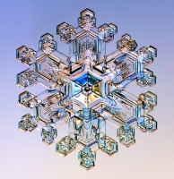
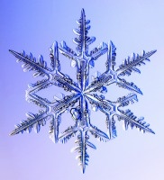
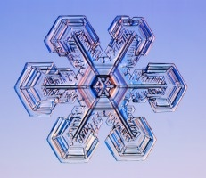
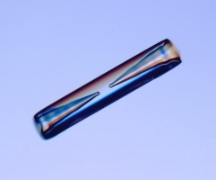
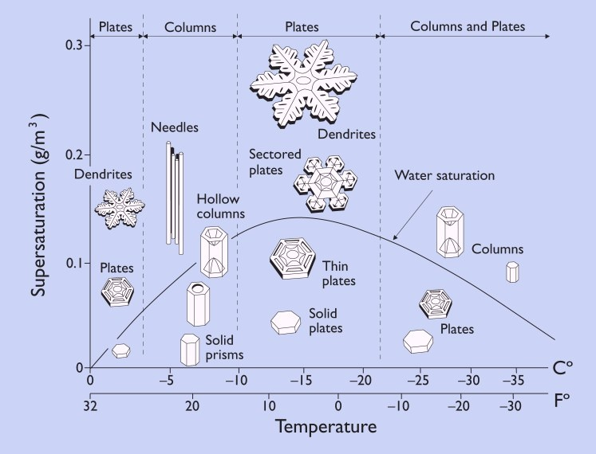
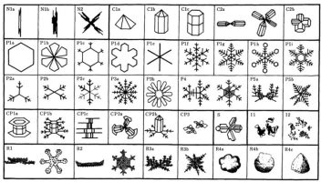

Voici enfin la première neige, (pourvu que ça dure...), l'occasion rêvée de se demander pourquoi les flocons de neige sont si beaux et variés.

   

Oui, le "bâton percé" est aussi un "flocon" de neige!

Justement il y a un excellent article ¹ à ce sujet dans le Pour La Science de février 2007. Le site de l'auteur  [SnowCrystals.com](http://www.its.caltech.edu/~atomic/snowcrystals/) montre de nombreuses images figurant aussi dans l'article, de même que  ce diagramme :

Ce diagramme montre dans quelles conditions de température et d'humidité se forment les principaux types de flocons, le long de la courbe qui définit la saturation en eau. C'est là le point important : les flocons se forment à partir de vapeur qui se condense et se solidifie instantanément autour de particules déjà solidifiées.

Les turbulences qui entrainent les flocons dans les nuages font varier les conditions de température et d'humidité pendant la formation des flocons, ce qui donne une énorme variété de formes.

J'adore cette histoire : depuis 1932 et pendant toute la 2ème guerre mondiale, le physicien nucléaire japonais Ukishiro Nakaya a été nommé professeur au nord du Japon, où il n'y avait aucune installation nucléaire. Il a donc étudié la neige jusqu'en 1954, année où il publia un ouvrage magistral en la matière, répertoriant des centaines de formes de flocons de neige classées dans les catégories ci-dessous:

Comme quoi un physicien peut être un peu poête, même dans un pays ravagé ...

### Référence :

1. Kenneth Libbrecht, "[La formation des cristaux de neige](http://www.pourlascience.fr/ewb_pages/a/article-19262-la-formation-des-cristaux-de-neige-.php)", Pour la Science N°352 - fevrier 2007
