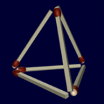

"Il faut penser différemment" écrit [Bernard Werber](w:) dans "Les Fourmis" quand il propose ce petit casse-tête.

Quand vous serez convaincu qu'il faut casser les allumettes (interdit!) , reprenez le problème à zéro en chronométrant combien de temps il vous faut pour "penser différemment" .

Le plaisir de l'éclair "haha" combiné à une certaine honte m'avaient frappé après environ 2 minutes. Et vous ?

Vous pouvez aussi lire directement la suite dans laquelle figure la solution, mais ça serait dommage...

\[expand title="cliquer la langue au chat..."\] Très peu de gens pensent immédiatement en 3D et trouvent la solution  : le tétraèdre. La majorité abordent le problème "à plat", et ne parviennent pas à élargir leur approche et à penser dans l'espace.

Même certains, expérience faite, dont le boulot consiste à convaincre les ingénieurs de quitter leurs outils de dessin 2D pour passer aux outils de Conception Assistée par Ordinateur (CAO) en 3D ...\[/expand\]
