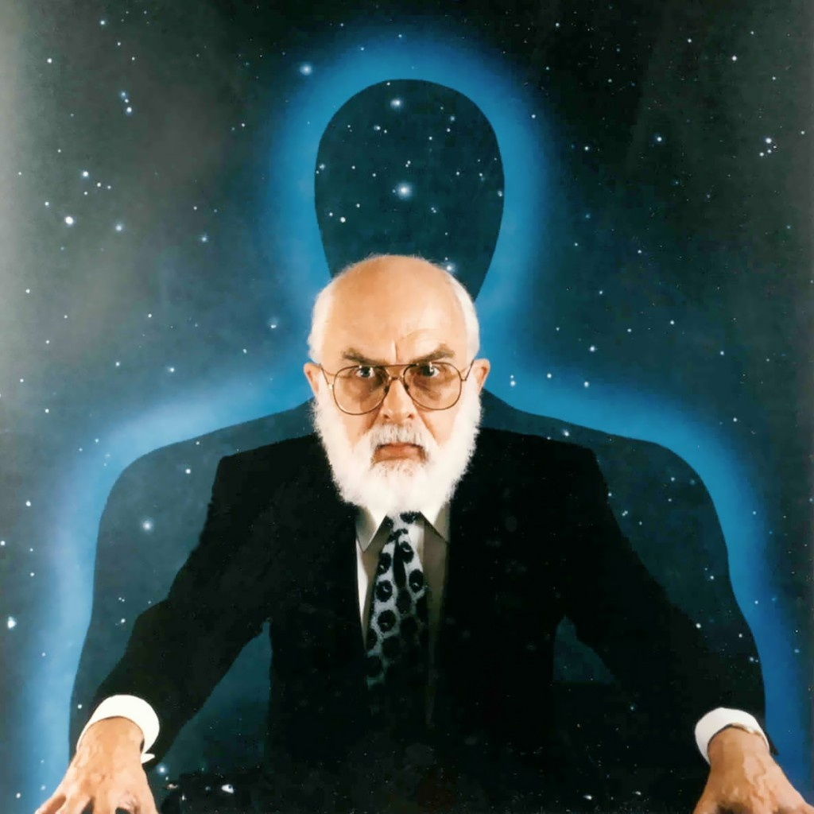

### ... vous pouvez gagner 1 million de dollars !

Il vous suffit de participer au "[One Million Dollar Paranormal Challenge](http://www.randi.org/site/index.php/1m-challenge.html)" que la "James Randi Educational Foundation" (JREF) propose depuis 1964.

Voici une traduction en français de leur proposition :

> La Fondation a pour objectif de fournir des informations fiables sur les phénomènes paranormaux. Elle soutient et conduit des recherches sur ces phénomènes.
> 
> La JREF offre un prix d' un million de dollars a quiconque peut montrer, sous des conditions d'observation strictes, une preuve de tout évènement paranormal, surnaturel ou occulte. La JREF ne s'implique pas dans la procédure de test autrement qu'en aidant à formuler le protocole et en acceptant les conditions dans lesquelles le test sera effectué. Tous les tests seront conçus avec la participation et approbation du participant. Dans la plupart des cas, on demandera au participant un test préliminaire relativement simple qui sera suivi du test formel en cas de succès. Les tests préliminaires sont habituellement conduits par des associés de la JREF directement au lieu de résidence du participant
> 
> A ce jour, personne n'a passé ne serait-ce que ce test préliminaire.

Pourtant il y a eu [près de 150 participations "sérieuses"](http://forums.randi.org/forumdisplay.php?f=43) jusqu'ici .

Actuellement, une [pétition en ligne](http://www.ipetitions.com/petition/cmonsylvia/) demande à [Sylvia Browne](https://fr.wikipedia.org/wiki/Sylvia Browne) , la plus célèbre voyante des USA de tenir [l'engagement qu'elle a pris publiquement à plusieurs reprises](http://www.randi.org/sylvia/index.html) de passer le test il y a 5 ans, mais ne l'a jamais fait. Cette initiative vient évidemment des milieux "skeptics" qui ont même créé le site [www.stopsylviabrowne.com...](http://stopsylviabrowne.com/)

Mon point de vue est plus mesuré. La JREF propose une démarche scientifique rigoureuse, comme on le voit par exemple dans l'émission "Homeopathy: The Test" de la BBC, décrite en français [ici](http://www.blogparanormal.com/insolite/medecines-douces-et-therapies-alternatives-une-menace-sectaire/) et dont le texte complet en anglais est [ici.](http://www.bbc.co.uk/science/horizon/2002/homeopathytrans.shtml)

Il faut donc "jouer le jeu" et éviter de donner aux défenseurs des "sciences occultes" des arguments pour refuser de participer à des tests rigoureux, comme les "ondes négatives" issues du scepticisme ambiant.

C'est malheureusement un travers dans lequelle la JREF me semble en train de tomber, à la lecture de pages de leur site (surtout des forums mal modérés en fait) qui traitent ouvertement certains participants de fraudeurs. Dès lors le challenge devient "gagner un million de dollars ou être ridiculisé publiquement", et on comprend leur réticence...
