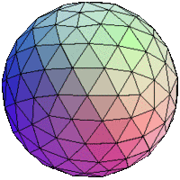
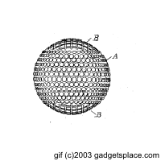
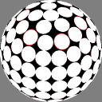
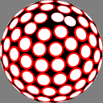
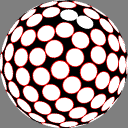

Cette question est cruciale pour la conception de balles de golf, mais aussi pour certaines fraises, de boules à facettes de discothèque. Et une fois qu'on sait y répondre pour une sphère, on peut s'attaquer aux surfaces quelconques, par exemple pour recouvrir de diamants une montre ou un bijou ...

D'abord, il faut définir ce qu'on appelle "régulièrement". Plusieurs définitions sont possibles, chacune correspondant à un problème et à des méthodes distinctes pour le résoudre :

- le "**covering**" consiste à recouvrir complètement la sphère par des disques de même rayon, appelé "rayon de couverture" ("covering radius" en anglais). Les disques sont donc forcés de se recouvrir partiellement. Mathématiquement on "minimise la distance maximale 'd' de tout point de la sphère à son voisin le plus proche". _(définition corrigée grâce à [Anton Sherwood](/2007/01/31/comment-placer-n-points-regulierement-sur-une-sphere/#comment-179) )_
- le "**packing**" est une petite nuance consistant à "maximiser la distance minimale entre les points". Autrement dit, l'optimum est atteint lorsqu'on ne peut plus écarter les deux points les plus proches car l'un se rapprocherait davantage d'un troisième point.
- le "**convex hull**" consiste à maximiser le volume du solide convexe défini par les N sommets
- la "**minimisation de l'énergie potentielle**" consiste à minimiser la somme de l'énergie qui serait accumulée dans des ressorts liant chaque paire de points. Les ressorts peuvent être soit linéaire (d'ordre 1), soit quadratiques (ordre 2) ce qui correspond au cas de la **répulsion électrostatique** de points supposés chargés électriquement.

Intuitivement on "sent" que certaines de ces méthodes devraient donner les mêmes résultats, mais ce n'est pas le cas sauf dans des cas très particuliers.

### Solutions exactes



Le seul problème pour lequel il existe des solutions exactes est le "covering" car en 1943 (seulement....) Fejes Tóth a trouvé la borne du "rayon de couverture" d en fonction de N (voir [ici](http://mathworld.wolfram.com/SphericalCode.html)) . Il a ainsi enfin été prouvé que :

- pour N=4, la disposition optimale correspond aux sommets d'un tétraèdre régulier
- pour N=6, aux sommets d'un octaèdre
- pour N=8, ce ne sont **pas les sommets d'un cube**, mais de l'[antiprisme carré](w:)
- pour N=12, ce sont les sommets d'un [icosaèdre](w:). L'icosaèdre (ci-contre) est formé de 20 triangles équilatéraux égaux
- pour N=20, on peut donc projeter sur la sphère les centres des 20 faces de l'icosaèdre, ce qui va avoir de l'importance dans la suite

de plus :

- pour N=5, on ne peut pas faire mieux que d'enlever un point de l'octaèdre (N=6)
- pour N=7, il faut dessiner sur la sphère des [triangles sphériques](http://mathworld.wolfram.com/SphericalTriangle.html) d'angle = 80° (étonnant, 2/9èmes de 360° ...)
- pour N=9, les triangles sphériques doivent avoir un angle tel que cos(angle)=1/4

et c'est tout pour les solutions démontrées comme optimales ! Les solutions du "packing" et du "convex hull" pour les mêmes valeurs de N semblent être les mêmes, mais on ne l'a jamais prouvé formellement !

Pour toutes les autres valeurs de N, les solutions ne peuvent pas être construites géométriquement, mais seulement par des méthodes approximatives.

### Solutions icosahédriques

Pour certaines valeurs de N, on peut construire de "jolis" arrangements "presque" optimaux en utilisant l'intéressante propriété de l'icosaèdre d'être optimal et d'avoir des faces triangulaires équilatérales. En subdivisant une face (qui est un triangle équilatéral) en plus petits triangles équilatéraux puis en projetant les sommets sur la sphère, et en appliquant la "symétrie icosahédrale" consistant à recopier ces points pour chacune des 20 faces de l'icosahèdre, on obtient les formes en "[géode](w:)" bien connues dans la construction

La page [Tables of Spherical Codes with Icosahedral Symmetry de R. H. Hardin, N. J. A. Sloane and W. D. Smith](http://neilsloane.com/icosahedral.codes/) fournit ce type de solutions pour N=60, 72, 80, 90 ... 78032. (l'applet n'a plus l'air de marcher, mais il y a du code C permettant de générer les solutions)

### Les balles de golf

Pour des raisons aérodynamiques, les [balles de golf](w:balle_de_golf) ont entre 300 et 450 petites cavités ("dimples" en anglais). C'est le règlement du golf qui impose qui doivent être réparties les plus régulièrement possible, alors que la stabilisation de la balle en vol pourrait être mieux assurée par une balle du type "polara", ayant des cavités différentes le long d'un équateur.

La plupart des balles de golf existantes sont donc construites par symétrie icosahédrale, en veillant à ce qu'il n'y ait pas de cavité le long d'une ligne pour permettre la réalisation de moules "simples". Comme on le voit ci-dessous, on peut remplir les faces triangulaires de l'icosaèdre de nombreuses façons, et même jouer sur la dimension des "dimples" pour tenter de compenser des irrégularités :



[Ce site](http://www.gadgetsplace.com/GOLFBALLCD.htm) vend un CD contenant plus de 800 brevets relatifs aux balles de golf, la plupart relatifs à la disposition des dimples (images ci-contre) ! Ceci prouve qu'il n'existe pas un N clairement optimal, ni une façon optimale de répartir les points.

### Méthodes "empiriques"

[Cette page](http://bendwavy.org/pack/pack.htm) présente 3 méthodes qui permettent de placer très rapidement des points à une distance à peu près égale à d les uns des autres, mais il n'est pas garanti que l'on arrive à en placer le nombre N souhaité. Il faut apparemment faire plusieurs essais avec des N'>N pour obtenir éventuellement un nombre N précis. Ces méthodes sont illustrées ci dessous pour N=124, qui ne permet pas une symétrie icosahédrique:

| Une [méthode proposée par Dave Rusin](http://www.math.niu.edu/~rusin/known-math/95/equispace.elect) consiste à placer les points le long de l'équateur (ou de chaque côté de l'équateur) à une distance d les uns des autres, puis le long de "latitudes" séparées d'une distance d. |
| --- |
| la méthode de [Saff et Kuijlaars est décrite par un petit algorithme dans une FAQ de maths](http://www.math.niu.edu/~rusin/known-math/97/spherefaq) : elle consiste à placer les points à distance d les uns des autres le long d'une spirale qui va d'un pôle de la sphère à l'autre. |
| une variante de la précédente basée sur une spirale utilisant le nombre d'or pour éviter toute régularité apparente. Je n'ai pas tout compris, mais cette méthode donne le meilleur résultat "visuel" |

La couleur rouge permet de comparer les méthodes : les disques sont réduits jusqu'à être tangents entre eux, et on colore en rouge la différence entre chaque diamètre et le diamètre le plus faible. On constate que la première méthode est systématiquement meilleure que les 2 autres, mais on "voit" qu'elle est encore loin de l'optimum

Référence : [page de liens sur le sujet "How can I arrange N points evenly on a sphere?"](http://bendwavy.org/sphere.htm)
