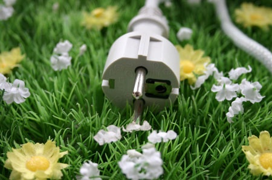

Les associations de défense de l'environnement ont lancé une action consistant à cesser volontairement toute consommation d'énergie entre 19h55 et 20h00 le 1er février.

L'aspect politico-symbolique étant amplement couvert ailleurs, je me suis intéressé au conséquences de cet événement sur la production d'énergie, ce qui permet de lancer une petite réflexion sur un de ses aspects méconnus.

Le [site du RTE (Réseau de Transport d'Electricité)](http://www.rte-france.com/fr/) qui permet de suivre la [consommation française en temps réel](http://www.rte-france.com/fr/developpement-durable/eco2mix/consommation-d-electricite) est catégorique : l'action n'a pas été suivie. On peut à peine distinguer un minuscule creux autour de 20h, à tout casser 2% de baisse de consommation par rapport à une courbe "lissée".

Mais si la consommation avait baissé brusquement de 10% comme l'espéraient les organisateurs, ça aurait pu poser un sérieux problème : ces 10% à une heure de forte consommation correspondent à 3 grosses centrales thermiques (nucléaires, charbon ou fuel). Or la particularité de l'électricité est qu'elle ne se stocke pas :

**il faut produire exactement la puissance consommée en temps réel.**

Or il est impossible d'arrêter la production des centrales thermiques si vite, et encore moins de la redémarrer 5 minutes après. Pour absorber une telle variation, on ne peut que combiner quelques solutions:

1. les échanges internationaux grâce à l'interconnexion du réseau
2. l'arrêt / mise en route de (petites) centrales hydro-électriques, qui peuvent être mises en/hors service en quelques minutes
3. le pompage : certaines usines hydro-électriques peuvent refouler de l'eau de la plaine vers les lacs d'altitude, ce qui permet de la réutiliser pour produire de l'énergie au moment voulu.

Avant de revenir sur ce dernier point, une spécialité suisse souvent méconnue, voyons comment les producteurs d'électricité ont anticipé l'effet des "5 minutes de répit pour la planète". Ils ont probablement désactivé un peu plus tôt une centrale à gaz ou à fuel dont la fermeture était prévue pour la nuit, en la remplaçant par quelques petites productions hydro-électriques qui ont absorbé la variation puis été débranchées au fur et à mesure de la réduction habituelle de la consommation pendant la nuit.

#### Energies renouvelables

On mesure souvent la production d'énergie solaire en KWh/an, ou en nombre de ménages : par exemple sur le [site des SIG](http://www.sig-ge.ch/corporate/innovations/nvelles_energ/sig_solar_3/production_en_direct/index.lbl), on lit que leur centrale solaire produit l'équivalent de la consommation de 140 familles. Ok, mais quand ? Comme on le voit sur la même page, la centrale produit de l'énergie quand il y a du soleil. Le jour. Pas le soir. Le soir, quand la consommation d'électricité est très élevée, le solaire ne produit rien. Et les éoliennes produisent quand il y a du vent. Si c'est à 4h du matin, quand la consommation est minimale et qu'on ne sait pas que faire de l'électricité, ça ne sert à rien.

En résumé:

- les centrales thermiques (nucléaires et autres) fournissent une grande puissance "de base", mais peu modulable en fonction de la demande. On la gère par une planification à long terme (plusieurs semaines)
- le solaire produit de l'énergie à heures fixes, en fonction de la météo, plus ou moins prévisible à quelques jours
- l'éolien est encore plus capricieux
- **l'hydro-électricité est la seule source d'électricité modulable à volonté et en plus capable de stocker l'énergie surproduite en raison de la faible modulabilité des autres sources d'énergie.**

Dans [un autre article](/2005/01/25/les-energies-renouvelables-en-suisse/), je montre que la Suisse, loin d'être en retard sur le plan des énergies renouvelables, est à la pointe européenne grâce à l'hydroélectricité. Avec l'Autriche, la Suisse est un maillon essentiel de l'approvisionnement électrique européen grâce à sa capacité à fournir la puissance nécesaire aux heures de pointe, et à absorber la surproduction nocturne, et cette position se renforcera encore.

Ce point ne doit pas être oublié lorsqu'on parle de l'énergie en Suisse : dire que notre pays e n'est pas autosuffisant car elle importe plus de KWh qu'elle n'exporte est un non-sens, car 1KWh exporté à midi vaut beaucoup plus que le même KWh importé à 4h du mat. Mon ami Jacky qui bosse dans ce domaine m'a parlé de certains jours de la canicule d'été 2003 ou le KWh acheté 2 cts la nuit pour pompage a été revendu plus d'un franc 12h plus tard ! Un facteur 10 est plus habituel, et se produit jour après jour, toute l'année.

Le pompage est l'investissement le plus incroyablement rentable qu'on puisse imaginer. Un jour viendra peut-être où les barrages valaisans se rempliront et se videront totalement chaque jour...
