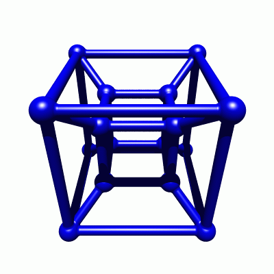
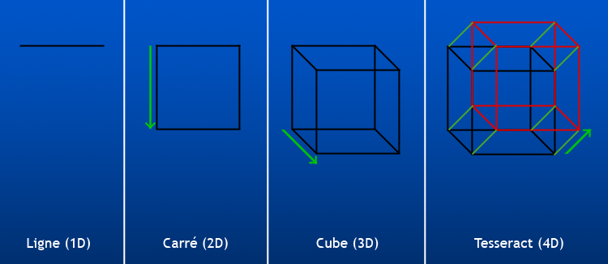

Cette petite animation montre un "hypercube" à 4 dimensions :

Elle donne un peu le tournis, mais montre que la 4ème dimension est accessible, avec un petit effort d'imagination

Sur cette image, on voit la logique de la construction d'un cube à 0,1,2,3 et 4 dimensions :

Dans un espace à 0 dimensions, il ne peut exister qu'un point.

Un espace à une dimension, c'est une ligne droite. Disons que notre point est à la position "0" de cette droite et étirons le le long de la droite sur une distance que nous appellerons "1". Nous obtenons un "segment". Notez que, si on regarde notre ligne depuis "dessus", on ne voit que le point correspondant à l'espace à 0 dimensions.

Prenons notre segment et étirons le perpendiculairement sur une distance 1 dans un espace désormais à 2 dimensions. Nous obtenons le carré, dont les 4 angles sont aux coordonnées (0,0), (0,1), (1,0) et (1,1). Notez que si on regarde le carré dans le plan, selon la direction "x" ou selon la direction "y", le carré nous apparaît comme un segment de l'espace à 1 dimension.

Etirons notre carré dans la direction "z" perpendiculaire à la feuille, nous obtenons le cube à 3 dimensions de côté 1. Pour obtenir les coordonnées des 8 sommets du cube, nous ajoutons simplement la coordonnée z=0 aux 4 sommets du carré dessiné sur la feuille : (0,0,0), (0,1,0), (1,0,0) et (1,1,0) et ajoutons les 4 sommets qui ont les mêmes coordonnées x et y, mais la coordonnée z=1 pour le carré tiré hors de la feuille : (0,0,1), (0,1,1), (1,0,1) et (1,1,1). Sur l'image, qui est en "2D" nous avons du ajouter un effet de perspective pour "voir" le cube, car le cube vu dans les directions x, y ou z appraitrait comme un carré à 2 dimensions.

Continuons sans nous poser de questions pour la "4ème dimension" : prenons le cube et étirons le dans une direction "t" perpendiculaire aux 3 directions x,y et z : nous allons obtenir une figure composée d'une cube à la coordonnée t=0 et d'un autre à la coordonnée t=1, chacun des 8 sommets du cube initial étant relié au sommet correspondant de l'autre cube. Les 16 sommets ont les coordonnées (0,0,0,0) (0,0,0,1) (0,0,1,0) (0,0,1,1) (0,1,0,0) (0,1,0,1) (0,1,1,0) (0,1,1,1) (1,0,0,0) (1,0,0,1) (1,0,1,0) (1,0,1,1) (1,1,0,0) (1,1,0,1) (1,1,1,0) (1,1,1,1). Ces coordonnées correspondent aux nombres de 0 à 15 écrits en binaire, et les arêtes de l'hypercube à 4 dimensions relient 2 points si seul "1 bit" diffère entre leurs coordonnées. C'est la même règle que pour les dimensions 1,2 et 3.

Il reste à faire un peu de perspective pour projeter l'hypercube dans un espace à 3 dimensions, sinon on ne verrait qu'un cube, et à projeter cette projection dans un espace à 3 dimensions pour l'afficher dans une image ou un film.

Reste à se demander à quoi peut correspondre cette "4 ème dimension". Les physiciens considèrent que le temps est la 4ème dimension de "l'espace-temps" dans lequel nous vivons. Comme je le montrerai dans un [prochain article](/2007/02/07/le-temps-une-4eme-dimension-imaginaire/), cette dimension n'est pas dans la même direction que la 4ème dimension "cartésienne" utilisée dans l'hypercube, mais elle peut faire l'affaire d'une manière intuitive.
