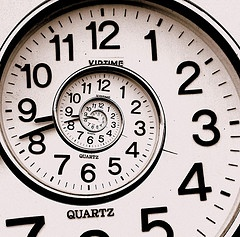

Dans "[voir en 4 dimensions](/2007/02/06/voir-en-4-dimensions/)", je montre comment un cube peut aider à se représenter une 4ème dimension spatiale facilement.

Ce deuxième article explique pourquoi le temps, la 4ème dimension de l'[espace-temps](https://fr.wikipedia.org/wiki/espace-temps) dans lequel nous vivons, n'est pas une dimension spatiale comme les 3 autres, mais une dimension [imaginaire](https://fr.wikipedia.org/wiki/Nombre_imaginaire_pur), au sens mathématique du terme : un temps élevé au carré est équivalent à une surface négative !

Imaginez qu'un cube de côté égal à 1 mètre surgisse du néant devant vous et disparaisse tout aussi soudainement 1 seconde plus tard. Le cube a donc été "étiré" dans la dimension du temps sur une distance de 1 seconde, et si vous êtes un "dieu" pour qui le temps est une dimension comme les autres, vous verriez cet événement comme un hypercube flottant dans un espace à 4 dimensions tel que décrit dans [l'article précédent](/2007/02/06/voir-en-4-dimensions/).

Mais le temps est-il une dimension "comme les autres" ? Le fait qu'on mesure le temps en secondes et les distances en mètres nous met sur la piste d'une différence fondamentale, qui tient à la manière dont on mesure les distances dans un espace.

Comment faire si une dimension ne se mesure pas dans les mêmes unités que les autres ? L'idéal serait de trouver un moyen de convertir les secondes en mètres. Et c'est ce qu'a fait Albert Einstein entre autres, en montrant que la vitesse de la lumière appelée "c" est une constante absolue, parce que justement elle mesure le rapport entre l'espace et le temps en chaque point de l'Univers : 1 seconde vaut 300'000 km.

Autrement dit, le"dieu à 4 dimensions" verrait le cube de tout à l'heure immensément allongé dans la direction du temps. Pour qu'il lui apparaisse comme parfaitement hypercubique, il n'aurait du apparaître que pendant 1/300'000'000 de seconde.

Mais ça ne suffit pas pour prouver que le temps soit une dimension "comme les autres". Les 2 dimensions d'une feuille de papier, tout comme les 3 dimensions de l'espace sont [euclidiennes](https://fr.wikipedia.org/wiki/Espace_euclidien) parce qu'on peut mesurer les distances entre des points par le théorème de Pythagore. Vous savez, celui qui dit que la carré de l'hypoténuse est égal à la somme des carrés des côtés.

- la diagonale de notre carré à 2 dimensions de côté 1 vaut \\(\\sqrt{1^2+1^2} = \\sqrt{2}\\)
- la diagonale de notre cube à 3 dimensions de côté 1 vaut  \\(\\sqrt{1^2+1^2+1^2} = \\sqrt{3}\\)
- mais la diagonale de l'hypercube unité dans l'espace temps vaut-elle vraiment \\(\\sqrt{1^2+1^2+1^2+1^2}\\), soit 2 ?

Cela revient à la question "comment mesurer la distance entre deux points distincts dans l'espace et le temps ?"

Pour y répondre, nous allons nous intéresser aux cercles et aux sphères plutôt qu'aux cubes, parce que tous les points sur un cercle ont la particularité d'être à la même distance du centre, comme d'ailleurs tous ceux à la surface d'une sphère. C'est même la définition mathématique de ces objets.

Commençons par remarquer que cette distance est toujours positive : le carré de l'hypoténuse ne peut jamais être un nombre négatif.

Maintenant, imaginons une ampoule située sur la Lune à une distance d=300'000 km d'ici et qui s'allume là bas exactement ... top ! maintenant. Elle nous paraîtra s'allumer exactement en même temps qu'une ampoule allumée ici t=1 seconde plus tard, autrement dit la "distance à 4 dimensions" d entre les 2 allumages d'ampoules et le "top" est la même.

Disons que le "top" est aux coodonnées (0,0,0,0), l'ampoule qui s'allume sur la Lune est aux coordonnées (x,y,z,0), et l'ampoule dans le labo aux coordonnées (0,0,0, c.t), c étant la vitesse de la lumière et t le temps après lequel on voit l'ampoule s'allumer, 1 seconde dans l'exemple.

On a donc: \[mathjax\]\\(d= c.t =\\sqrt{ x^2+y^2+z^2}\\), soit: \\(d^2= c^2.t^2 = x^2+y^2+z^2\\), ce qui donne la relation : \\(\\boldsymbol{x^2+y^2+z^2-c^2.t^2 = 0}\\)

Plus généralement, la distance d entre deux événements situés en (x,y,z,t) et en (x',y',z',t') dans l'espace-temps s'écrit

**d2\=(x-x')2+(y-y')2+(z-z')2 - c2.(t-t')2**

Ce n'est pas une distance euclidienne à cause du signe "moins", donc le temps n'est pas une dimension "comme les autres", même après l'avoir transformé en distance grâce à la vitesse de la lumière. L'espace-temps n'est donc pas un [espace euclidien](https://fr.wikipedia.org/wiki/espace_euclidien), mais un [espace de Minkowski](https://fr.wikipedia.org/wiki/espace_de_Minkowski).

A moins que l'on puisse remplacer c par quelque chose qui deviendrait négatif en l'élevant au carré, mais le carré de tous les nombres réels est positif ... On ne peut faire intervenir que le nombre imaginaire i, tel que i2\=-1 par convention.

Avec cette astuce, la distance devient "euclidienne" parce qu'on peut l'écrire : **d=dx2+dy2+dz2 + c2(****i.dt)2**

Mais ceci montre que le temps est une dimension très spéciale car, tout en étant "perpendiculaire" à l'espace, on doit accepter qu'une distance mesurée entre deux événements dans le temps, au carré, correspond à une surface négative : le temps est donc une dimension "imaginaire" de l'espace-temps.

### Références:

- [http://www.astrosurf.com/luxorion/relativite-restreinte3.htm](http://www.astrosurf.com/luxorion/relativite-restreinte3.htm)
