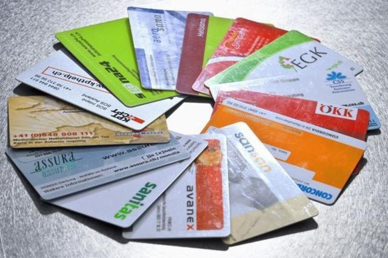

L'initiative populaire sur laquelle le peuple et moi-même voterons le 11 mars propose de changer fondamentalement de système de santé en Suisse. Son [texte](http://www.admin.ch/ch/f/pore/vi/vi316t.html) est exceptionnellement court et simple :

> Art. 117, al. 3 (nouveau) La Confédération institue une caisse unique pour l'assurance obligatoire des soins. (...) La loi règle le financement de la caisse. Elle fixe les primes en fonction de la capacité économique des assurés.

Dans un [article précédent](/2007/02/09/les-couts-de-la-sante-en-suisse/), j'ai montré que les coûts de la Santé en Suisse ne sont pas disproportionnés. Voyons maintenant si on pourrait quand même réduire la charge sur les ménages en adoptant le système proposé.

Dans beaucoup de pays européens (à majorité ou tradition socialiste), les coûts sont couverts à quasi 100% par l'Etat, au travers de la "sécurité sociale". En Suisse, les coûts sont assumés:

- à 50% par les caisses-maladie, donc les primes des ménages
- à 25% par les assurances complémentaires et les franchises des ménages
- à 15% par les pouvoirs publics (essentiellement les subventions cantonales aux hôpitaux)
- à 10% par les autres assurances sociales (assurance accident, assurance invalidité et assurance militaire)

Ca fait donc 75% payés par les ménages et 25% au travers des impôts. Ce sont clairement ces 75%, qui posent problème à de nombreux ménages. Pour ma famille de 2 adultes et 2 enfants à Genève, ça représente par exemple plus de Frs 10'000/an ... La Solution ?

L'initiative "pour une caisse unique" propose 2 solutions pour les 2 aspects du problème:

1. **La "caisse unique" pour maîtriser l'augmentation des coûts.** Comme on l'a vu dans l' [article précédent](/2007/02/09/les-couts-de-la-sante-en-suisse/), la marge d'économie est faible, mais existe peut-être. Vaut-il la peine de bouleverser le système actuel pour quelques % hypothétiques, à vous de voir ...
2. **Des "primes en fonction de la capacité économique des assurés" pour le financement.** En fait c'est le point important de l'initiative et en parlant systématiquement de la "caisse unique" on occulte ceci, ce qui était probablement le but des initiants... Il faut bien réaliser que cette proposition ne réduit pas du tout les coûts : elle vise à les répartir différemment, mais **sans dire comment !** "_La loi règle le financement de la caisse"_ permet en théorie de de moduler entre la situation 75%/25% actuelle et le 0%/100% de la "sécurité sociale", puisqu'une prime dépendant du revenu, payée à une caisse unique, ça s'appelle un impôt.

Et là toutes sortes de questions méritent d'être posées, mais ne le sont pas car "_La loi règle le financement de la caisse"_ donc on se les posera plus tard. Par exemple:

Puisqu'il y aura toujours des primes fixées par canton, (les Suisse-allemands ne veulent parait-il pas payer pour les Romands, mais le sondage "[Perspective Suisse](http://www.goulu.net/wordpress/perspective-suisse)" dit le contraire) les riches paieront pour les pauvres dans le même canton, alors:

- peut-on faire un barème de progression de la prime qui ne dépende pas du canton ?
- comment un canton de "pauvres" (Jura? désolé...) pourra-t-il avoir des comptes équilibrés par rapport à un canton "de riches" (Zoug?)

Je voterai donc "NON" à l'initiative "pour une caisse unique":

- parce qu'elle est populiste : elle appate le citoyen avec l'idée de payer moins de primes, mais ne réduit pas les coûts de manière convaincante,
- mais surtout parce qu'elle repousse la difficulté du financement sur une loi qui sera impossible à fixer.

Dans un prochain article, je re-proposerai  une vieille "Idée Non Standard" sur le sujet, qui commence à faire son chemin ...
