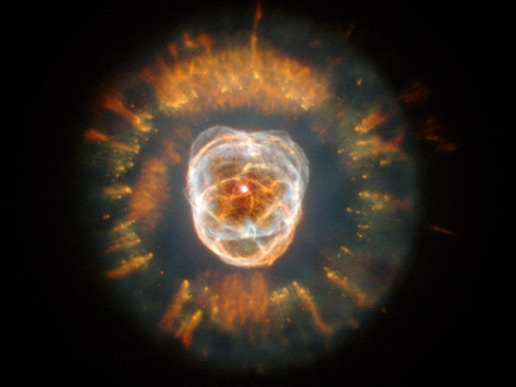

De retour du ski avec plein d'idées d'articles, je consulte mes flux RSS et tombe illico sur cette splendide photo prise par Hubble, sur le site ["Image of the Day" de la NASA](http://www.nasa.gov/multimedia/imagegallery/index.html).

La "Nébuleuse de l'Esquimau" est une nébuleuse planétaire provoquée par l'explosion de l'étoile centrale il y a environ 10'000 ans. Selon le textesur le site de la NASA, on ne comprend pas tout, notamment les filaments oranges qui entourent tout le système.

C'est peut-être un règle universelle : on trouve plus belles celles qu'on ne comprend pas ...
