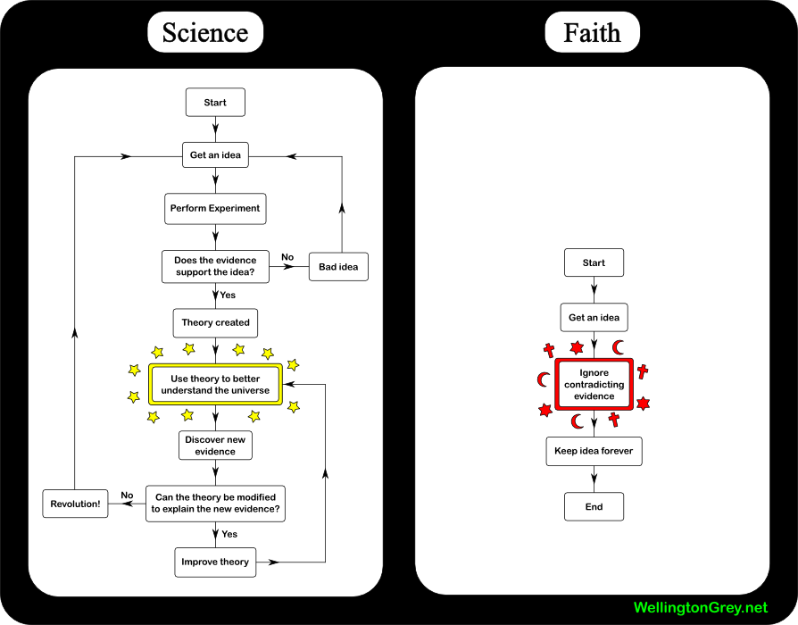

[Bad Astronomy](http://blogs.discovermagazine.com/badastronomy/) renvoie à un [diagramme comparant la science et la foi](http://www.wellingtongrey.net/miscellanea/archive/2007-01-15%20--%20science%20vs%20faith.html).

Provocateur (volontairement?), il me semble qu'il aurait pu être plus intéressant en:

- introduisant la possibilité d'une boucle infinie dans la "foi", ou une fin possible à la science, telle que le positivisme de la fin du XIXème le postulait.
- couplant les 2 parties du graphe : les "evidence" qui troublent la foi proviennent souvent de l'activité scientifique, et certaines théories scientifiques se sont basées à l'origine sur des convictions "religieuses".
