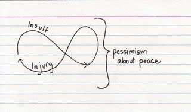

Trouvé sur "[indexed](http://thisisindexed.com/)" un de ces dessins minimalistes qui me semble parfait pour décrire la situation de certains conflits, [Israël - Palestine](http://www.goulu.net/wordpress/conflit-israel-palestine) entre autres :

Le titre "Who hit who first doesn't matter anymore." est d'une simplicité désarmante, mais finalement, [M Monnerat](http://www.ludovicmonnerat.com/) par exemple, dites-nous comment sortir d'une telle situation, de préférence sans atomiser ni gazer une des parties ?
