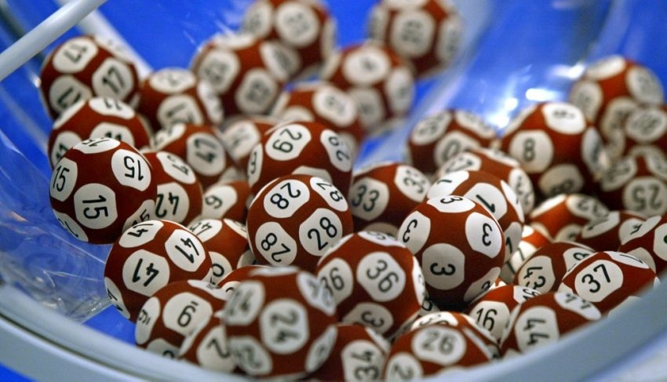

_Publié sur ["Virus" de la RSR](http://virus.rsr.ch/depenses-pour-un-gain-facile) le message suivant :_

J'ai une martingale qui me permet de gagner Frs 5.- chaque semaine : je ne joue pas.

Les loteries ne redistribuent qu'environ la moitié du prix des billets sous forme de gains, donc en jouant très longtemps on ne peut espérer récupérer que la moitié de ce qu'on a dépensé, à moins de décrocher le gros lot, bien sur.

Or la probabilité de gagner ce gros lot est surévaluée par la plupart des gens : à l'Euro Millions, on a une chance sur 76 millions de trouver la bonne combinaison. C'est légèrement moins probable que de gagner 5 fois de suite à la roulette en plaçant la première fois 1 Fr sur une case, puis les 36 Frs gagnés encore sur une seule case puis les Frs 1296.- gagnés la 2ème fois encore sur une seule case et ainsi de suite encore 2 fois. Quel fou jouerait ainsi ? Pourtant, avec la même chance de gain, on atteint le même gros lot pour 1 Frs au lieu de Frs 3.20 ! Tout ceci pour montrer que jouer à la loterie est totalement irrationnel.

Les gens qui ont une vague idée des probabilités jouent au casino, qui retourne par exemple 36/37èmes, soit 97% des enjeux sous forme de gains à la roulette. Reste à ne pas devenir accro au jeu au casino...

Pour ça, j'ai aussi une recette : Payez-vous un voyage à [Las Vegas](http://www.goulu.net/wordpress/las-vegas) et perdez quelques centaines de dollars dans les luxueux établissements de cette ville de fous. A votre retour, tous les casinos européens vous apparaitront comme de sombres bouis-bouis dans lesquels vous n'aurez plus jamais envie d'entrer. Guéris ! (mais ne retournez pas à Vegas...)

_et une réponse à "Myrtille" qu se demande si la Loterie est truquée :_

Myrtille, pas besoin que la Loterie triche, elle gagne assez sans ça (voir mon autre message) Si ça t'intéresse, il existe des "tests statistiques" qui permettent de vérifier mathématiquement qu'il n'y a pas triche. J'ai trouvé ce très bon [article sur le test de la loterie du Quebec](http://web.archive.org/web/20071108025251/http://www.cmathematique.com/cgi-bin/index.cgi?page=contenu1_117_10_36) qui explique comment ça marche.

Ils expliquent aussi que la seule façon "intelligente" de jouer à la loterie est d'éviter de jouer les numéros joués fréquemment, afin de réduire la probabilité de devoir partager le gros lot.
