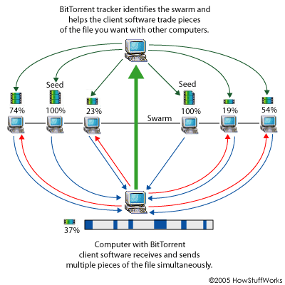

A l’origine, [BitTorrent](w:en) est un protocole génial permettant la diffusion rapide de gros fichiers et la répartition de la charge sur plusieurs serveurs. Il a récemment muté en outil de piratage intensif, mais pourrait bien devenir une brique de l’internet du futur.

### Simplement Génial

La plupart des connexions internet sont asymétriques : avec votre ADSL, vous pouvez recevoir des informations depuis internet entre 5 et 10x plus vite que vous ne pouvez en envoyer. Le débit réel de réception (« download ») est donc souvent limité par le débit en émission du serveur (« upload », divisé par le nombre de personnes qui y accèdent) plutôt que par votre vitesse de réception.

Le principe théorique de BitTorrent pour remédier à cela est simple : on divise le contenu en petits morceaux, mettons par exemple 10. Si 10 personnes demandent le fichier presque simultanément, on envoie à chacune une partie différente. Dès que le client a reçu sa partie, il la met automatiquement à disposition des autres, qui peuvent alors recevoir les 9 parties qui leur manquent des 9 autres clients simultanément, ce qui fait que les 10 obtiennent le fichier complet en 2x le temps qu’il faut pour transférer 1/10ème du fichier. En pratique, on arrive souvent au débit maximal de téléchargement c’est quand même beaucoup mieux que d’attendre des heures de télécharger un fichier depuis un serveur unique.

Comme BitTorrent était assez compliqué à mettre en oeuvre, il a jusqu’ici été utilisé pour des appplications sérieuses et professionnelles comme les « appliances » VMWare dont j’ai déjà un peu parlé [ici](http://www.goulu.net/wordpress/emulation-et-virtualisation) (pas assez, j’y reviendrai)

### La pompe à films

Pendant ce temps, le téléchargement illégal de fichiers évoluait de son côté. Depuis que Napster vit son « service » de téléchargement de musique fermé pour avoir commis l’erreur de stocker des fichiers soumis à copyright sur son serveur, les systèmes « peer-to-peer » (P2P) comme [eMule](http://www.emule-project.net/home/perl/general.cgi?l=13) ne fonctionnent plus avec des serveurs mais permettent l’échange direct de fichiers entre ordinateurs. Comme c’est le téléchargement, mais surtout la mise à disposition d’oeuvres ou logiciels protégés par le droit d’auteur qui est illégal ([voir ici pour la loi suisse](http://www.suissimage.ch/f/)), ces logiciels décentralisés sont eux parfaitement légaux, ou du moins aucune action en justice n’a réussi à les stopper…

Avec l’augmentation des débits de nos connexion ADSL, il devient envisageable de télécharger non plus seulement de petits fichiers de musique en MP3 de quelques Mo, mais des logiciels piratés sur CD complets (200 à 500 Mb) et de plus en plus souvent des films entiers en qualité DVD (1.2 à 4 Gb, et la haute définition arrive…), et là les protocoles utilisés par eMule et consorts atteignent leurs limites : ça prend des jours de télécharger ces gros fichiers.

Gros fichiers, gros fichiers … mais bien sur ! Pourquoi ne pas utiliser BitTorrent qui est fait pour ça ? Et voici fleurir les clients BitTorrent faciles à utiliser comme [uTorrent](http://utorrent.com/) et les moteurs de recherche spécialisés comme [Torrentz](http://www.torrentz.com/) …

Avec ça, tous les films récents sont chez vous en quelques heures ! Par contre il est plus difficile de retrouver de vieilles petites choses rares avec Torrent qu’avec eMule par exemple.

### du Torrent à l’Ocean : l’avenir

Une terrible bagarre se prépare pour la TV du futur, qui sera probablement un service de video à la demande diffusé par internet. Il faudra transférer de gros contenus à beaucoup de clients simultanément, mais pas en même temps. En visitant [BitTorrent.com,](http://www.bittorrent.com/) vous verrez que c’est exactement dans cette direction que se dirige le créateur du protocole, espérant gagner finalement un max de blé avec son invention géniale.

Plus généralement, BitTorrent pourrait bien devenir une brique essentielle d’un « système de fichiers distribué » universel qui remplacerait le vieux FTP et tous les systèmes de téléchargement existants. Juste une idée …

[(article également publié sur Microclub.ch)](http://microclub.ch/2007/03/03/bittorrent-du-genial-au-pire-to-pire-et-au-dela/)
