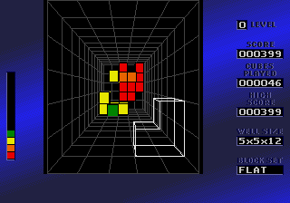

Après Tetris en 1984 , il y a eu [Blockout](http://en.wikipedia.org/wiki/Blockout) en 1989 : un des premiers jeux fondamentalement 3D, où il fallait empiler de manière compacte des pièces tombant dans un puits. C'est simple : il n'y a plus eu de jeu de "réflexion géométrique rapide" aussi prenant après ça, sinon je le saurais.

Alors que je pensais être condamné à utiliser MAME ou un autre émulateur pour retrouver les plaisirs de Blockout, voici que je tombe sur une version en ligne [3DTRIS](http://www.3dtris.de/) qui est très chouette mais un peu simpliste comparée au jeu original.

En cherchant un peu, je découvre que je jeu original de California Dreams existe toujours et fonctionne encore sous Windows XP ! On peut [l'obtenir ici.](http://www.blockout.de/index_english.html)
