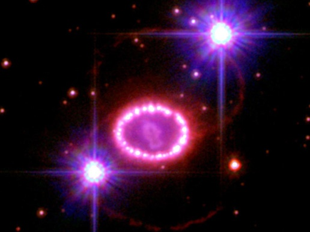

Il y a 167'020 ans, la lointaine étoile "Sanduleak -69° 202" explosa.

Comme elle est à 167'000 années-lumière d'ici, ce n'est qu'en 1987 qu'on put admirer le spectacle de la [Supernova SN 1987A,](w:SN_1987A) la plus proche explosion d'étoile depuis [SN 1604,](w:SN_1604) qui n'avait pu être immortalisée que sur des gravures et tapisseries du Moyen-Age.

1987A est par contre observée par de nombreux télescopes, dont Hubble qui a pris récemment cette [spectaculaire photo](http://www.nasa.gov/multimedia/imagegallery/image_feature_773.html) :

Les deux gros points blancs sont des étoiles plus proches qui n'ont rien à voir avec la supernova, mais ont le bon goût d'avoir presque la même luminosité et d'être joliment placées de chaque côté.

Par contre l'anneau d'un diamètre d'environ une année lumière formé de "perles" lumineuses est unique. Il s'agirait de grumeaux de matière crachés par l'étoile environ 20'000 ans avant qu'elle n'explose et réchauffés par l'explosion. Tout ça constitue la matière première idéale pour que des planètes se forment dans quelques milliards d'années.

Il y a aussi 2 anneaux rouges plus fins, sur des plans décalés symétriquement par rapport au plan des perles. Il s'agirait de l'onde de choc éclairée par le faisceau de particules émis par un pulsar ou un trou noir qui n'est apparemment pas le reste de Sanduleak, mais un voisin très proche.

Toutes ces infos et bien d'autres sont soigneusement détaillées dans l'article [SN 1987A de la Wikipedia](w:SN_1987A) , mais je voulais dire une chose importante en plus : c'est vachement beau !
