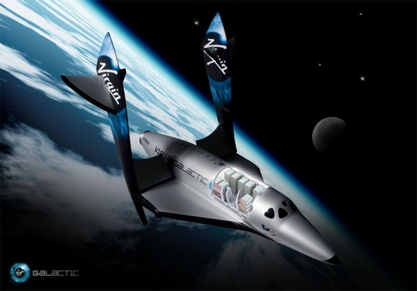

Vu sur Arte l'autre jour un reportage passionnant sur [SpaceShipOne,](http://www.scaled.com/projects/tierone/) le premier vaisseau spatial privé. En 2004, ce projet financé par Paul Allen (Microsoft) et Richard Branson (Virgin) a remporté le [Ansari X-Prize](http://www.xprize.org/xprizes/ansari_x_prize.html) de $10'000'000 en effectuant 2 vols à plus de 100'000 m d'altitude en moins de 2 jours.



En regardant la vidéo de ce vol, je retrouve le petit picotement du suspense à l'époque des missions Apollo... Il faut dire que cet engin exploite une idée assez folle, qui remet en question pas mal d'idées reçues : il n'a pas besoin de bouclier thermique ni de manœuvre précise pour la rentrée dans l'atmosphère !

L'idée géniale est de faire une aile pivotante : on la met perpendiculaire au fuselage du vaisseau pour la rentrée, ce qui positionne le vaisseau correctement tout seul. Léger, il se comporte comme une plume, oscille, se balance dans tous les sens jusqu'à se stabiliser dans les couches denses. On remet l'aile en position aérodynamique et SpaceShipOne revient sur Terre en planant !

Le SpaceShipTwo en construction emportera 2 pilotes et 7 passagers dès 2008 si tout va bien, et ceci marquera le début du tourisme spatial commercial.

### Risques:

Si le prix du billet n'était pas un problème, prendriez-vous le risque ? Comment évaluer la fiabilité d'un tel engin et le risque d'y laisser sa peau comme simple client ? C'est la question posée dans "[How safe is space tourism ?](http://blogs.discovermagazine.com/badastronomy/2007/03/07/how-safe-is-space-tourism/)" sur Bad Astronomy.

Voici la traduction française de ma réponse:

> Facile : demandez à n'importe quelle assurance quelle prime elle demanderait pour assurer votre vie ;-)
> 
> Ce n'est qu'après les désastres de Challenger et Columbia qu'il est apparu que la fiabilité de la navette spatiale n'était pas de 99% comme on le pensait, mais plutôt autour de 90%.
> 
> L'analyse du risque est un travail bien plus difficile que les statistiques. Et le cycle d'amélioration par "analyse de la panne et correction" est bien mieux maitrisé que l'approche "faire juste à 100% du premier coup" qui reste purement hypothétique.
> 
> J'ai donc bien peur que nous devions attendre les premiers accidents pour répondre à votre question et rendre le tourisme spatial plus sur.
> 
> La même question posée en termes commerciaux serait "quelle fiabilité exigeriez-vous pour voler dans l'espace si le prix n'était pas un problème ?".
> 
> Personnellement, je dirais 99% maintenant, ou autour de 80% si j'avais une saleté de cancer...

Et vous ?
