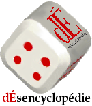

Merci à Jean-Daniel de m'avoir indiqué la [Désencyclopédie, portail de la désinformation.](http://desencyclopedie.wikia.com/wiki/Accueil)

Ce site hilarant est une parodie de la désormais célèbre [Wikipedia](http://fr.wikipedia.org/wiki/Wikip%C3%A9dia:Accueil_principal), une fabuleuse encyclopédie en ligne un peu victime de son succès. A l'origine, l'idée était de laisser tout un chacun contribuer à la Wikipedia, mais des dérapages ont requis d'engager des centaines de personnes pour valider les informations et éviter les conflits...

La Désencyclopédie n'est absolument pas touchée par ce problème (pour l'instant...) car elle revendique au nom de l'humour une liberté d'expression totale, donc à des années lumière du "politiquement correct"

Le meilleur moyen de la visiter est certainement d'utiliser la fonction "[une page au hasard](http://desencyclopedie.wikia.com/wiki/Sierra_Leone)", dont je m'étais toujours demandé à quoi elle pourrait bien être utile sur Wikipedia et les autres Wikis basés sur [MediaWiki](http://www.mediawiki.org/wiki/MediaWiki) auxquels j'ai eu le plaisir de contribuer (Goulu.net était basé sur MediaWiki il y a très longtemps, peut être 2 ans...)

Une seule chose me turlupine : est-ce que l'avertissement au bas de la page d'accueil s'applique à l'avertissement lui-même, ou pas ?

_Le contenu de ce site, le site lui-même, et les administrateurs du site, sont une immense parodie sans queue ni tête à la sexualité douteuse et à l'hygiène approximative. Si vous prenez au sérieux un traître mot de ce qui est écrit, vous êtes encore plus con que vous en avez l'air._
