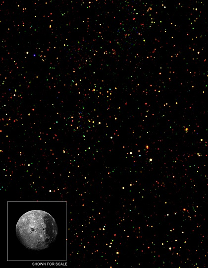
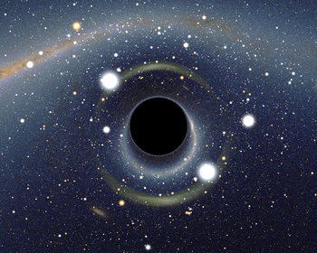
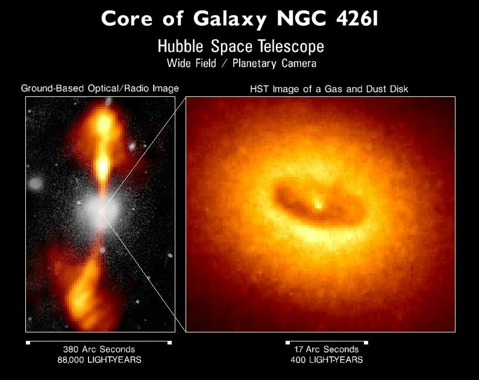

Sur cette image d'un petit bout de ciel grand comme quelques fois la lune placée là pour l'échelle, chaque point de couleur révèle la position d'un trou noir. Il y en a environ 1300, ce qui laisse supposer qu'on en répertoriera des millions dans les prochaines années.

Ce résultat est du au satellite [Chandra](http://chandra.harvard.edu/photo/2007/bootes/), spécialisé dans la détection de ces objets aussi monstrueux qu' invisibles. <!--more-->

La caractéristique la plus connue d'un [trou noir](w:) est d'être tellement massif (au moins des centaines de fois plus lourds que le Soleil) que même la lumière ne peut pas s'en échapper : l'attraction est trop forte, les rayons lumineux "tombent" dans le trou noir et n'en ressortent jamais. Donc, pas moyen de le "voir" directement.

Un trou noir "immobile" vu à quelques kilomètres de distance ressemblerait à l'image ci-dessous, et serait donc parfaitement indétectable depuis la Terre.

 (tiré de [l'article "trou noir" dans la Wikipedia](w:Trou_noir))

Mais les trous noirs se forment par l'"effondrement gravitationnel" de matière qui ne peut pas s'empêcher de tourner et, par le principe de conservation du moment cinétique, aussi appelé "théorème de la patineuse" en l'honneur patineuse inconnue qui eut l'idée de ramener bras et jambe près du corps pour pirouetter plus vite, un trou noir tourne très vite sur lui même. Pour se faire une idée, un trou noir est plus petit, plus lourd et tourne donc plus vite qu'un [pulsar](w:), et on connait des pulsars aussi lourds que le Soleil qui tournent plusieurs centaines de fois par seconde sur eux-mêmes !

Bref, un vrai trou noir tourne vite, et Einstein prétend que l'espace lui-même s'enroule autour de lui, ce qui force la matière attirée par le trou noir à "tomber en spirale". Mais il arrive un moment où la force centrifuge sur la matière tournant autour du trou noir équilibre son attraction, et ceci avant que la matière n'aie passé le point de retour de "l'horizon des événements".

En pratique (je vous épargne les calculs...) un "disque d'accrétion" se forme avec de la matière tournant pratiquement à la vitesse de la lumière autour du trou noir, bref, le tout forme alors un gigantesque accélérateur de particules naturel. Pour un trou formé par une étoile effondrée, ce disque est trop petit pour être observé directement, mais Hubble a photographié un disque d'accrétion d'un "trou noir supermassif" siégant au centre d'une Galaxie :

Les disques d'accrétion, eux, sont très lumineux car cette matière accélérée à une vitesse prodigieuse s'entrechoque, se chauffe à des températures incroyables et émet un rayonnement extrêmement énergétique  : des "rayons X".

C'est pourquoi Chandra est un détecteur de rayons X : l'image du début de cet article correspond aux sources de rayons X qui n'ont pas d'autre explication possible que le rayonnement de disques d'accrétion tournant à la vitesse de la lumière, qui n'ont eux-mêmes aucune autre possibilité d'exister qu'autour d'un trou noir.

En vérifiant où se trouvent ces trous noirs, on retrouve fort heureusement les centres de beaucoup de galaxies, ce qui confirme que les trous noirs supermassifs au centre des galaxies ne sont pas l'exception, mais la règle.

Reste un léger problème : on ne reçoit pas les mêmes rayons X selon qu'on observe le disque "de face" ou "sur la tranche", et normalement on devrait obtenir toutes les variantes intermédiaires, et ce n'est pas le cas dans les mesures de Chandra...

Comme souvent en science, une réponse spectaculaire à une question importante ne se termine pas par un point final, mais par un autre "pourquoi ... ?"
