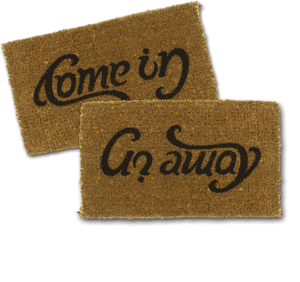

Il est pas magnifique ce paillasson ? en entrant, vos visiteurs lisent un message de bien venue : "Come In", entrez. Et en partant "Go away", foutez le camp :-)

Ces textes qui se lisent dans plusieurs sens s'appellent des [ambigrammes](http://fr.wikipedia.org/wiki/Ambigramme).  Ils sont beaucoup utilisés en plublicité, comme le célèbre logo de "New Man".  Vous pouvez en trouver d'autres:

 

- sur le [site de  Scott Kim](http://www.scottkim.com/inversions/index.html), un génie de l'ambigramme, qui n'a malheureusement plus l'air d'y ajouter de nouvelles créations
- sur [cette page du blog JesWeb](http://jesweb.net/?2005/12/21/51-les-ambigrammes-un-captivant-jeu-typographique)
- dans le roman "[Anges et Démons](http://public.web.cern.ch/public/fr/Spotlight/SpotlightAandD-fr.html)" de Dan Brown
- sur ce fantastique [générateur d'ambigrammes](http://jean-paul.davalan.pagesperso-orange.fr/liens/liens_ambi.html) , vous pourrez créer vos propres ambigrammes et consulter une impressionnante liste d'autres sites sur ce sujet
