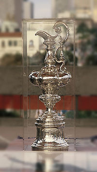

En juin aura lieu à Valence la compétition reine de la voile, la [Coupe de l'America](http://fr.wikipedia.org/wiki/Coupe_de_l'America). Je me suis aperçu que certaines de mes connaissances avaient besoin d'une petite introduction simple à la voile et à cette compétition pour pouvoir l'apprécier à sa juste valeur, donc voici quelques bases à connaitre quand on n'y connait rien.<!--more-->

### un peu d'Histoire

En l'an de grâce 1851, la goélette "America" eut l'outrecuidance de battre les 14 voiliers les plus rapides de sa Gracieuse Majesté, grâce à une arme technologique décisive : les voiles en coton. Les Anglais dépités refilèrent aux 'ricains une moche [aiguière](http://fr.wikipedia.org/wiki/Aigui%C3%A8re) en argent qui trainait dans un coin du Royal Yacht Club de Cowes, et les cow-boys la trouvèrent magnifique et la baptisèrent "Coupe de l'America".

La Coupe se disputa ensuite à un rythme irrégulier, mais toujours sur le principe du défi : un seul "challenger" est sélectionné pour affronter le "defender" titulaire de la Coupe, qui définit le lieu et les règles de la course, ce qui donne un avantage certain au "defender"

Les Américains réussirent ainsi à conserver le trophée pendant plus de 150 ans, jusqu'en 1983 ou les Australiens parvinrent enfin à le leur ravir, mais la Coupe retourna ensuite aux USA en 1987. Depuis 1992, certains règles furent établies pour rendre la compétition plus attractive, car l'éventualité que la Coupe reste un autre siècle en Amérique ne motivait personne. Suite à ceci, la Nouvelle-Zélande gagna en 1995 et parvient à conserver la coupe à l'édition de 2000.

En 2003, à la surprise générale c'est le [Team Suisse Alinghi](http://www.alinghi.com/fr/) qui ramena le plus ancien trophée sportif en Europe après 152 ans ! A part le principe du défi déjà mentionné, il n'y qu'une autre règle depuis 1851 : le compétition doit se dérouler sur mer, ce qui exclut, hélas, le beau lac Léman. C'est pourquoi, après une mise au concours de diverses villes européennes, la compétition aura lieu à Valence.

### Parcours et Match-Race

Les duels entre "challengers" pour déterminer le "challenger" qui affrontera le "defender" se disputent selon les [règles du "match-race"](http://www.americascup.com/fr/acclopaedia/understanding/match_racing_rules/index.php) sur un parcours très simple :

- les deux bateaux partent d'une ligne délimitée par 2 bouées, et qu'ils n'ont pas le droit de franchir avant le début de la course
- ils doivent tourner autour d'une bouée située à environ 3 km "au vent", soit exactement face au vent depuis la ligne de départ, ce qui fait qu'ils doivent "remonter le vent" en "tirant des bords de près" (j'explique plus bas)
- ils reviennent ensuite vers la ligne, donc "vent arrière" ou plutôt "grand largue", avec une voile spéciale, le spinnaker
- ils tournent ensuite autour de l'une des 2 bouées délimitant la ligne, et refont le parcours encore deux fois
- le premier bateau qui franchit la ligne après 3 aller-retours marque un point. Le premier qui a 5 points repart avec la Coupe.

Ce qui fait l'intérêt d'une course apparemment simple c'est:

1. qu'un voilier ne peut pas avancer directement contre le vent. Il doit zig-zaguer, en parcourant au minimum la moitié de la distance en recevant le vent sous un angle d'environ 30°, puis "virer de bord" en changeant les voiles de côté pour parcourir l'autre moitié en recevant le vent à 30° toujours mais sur l'autre côté du bateau. Pour des raisons mentionnées plus bas, la remontée au vent se fait souvent en "tirant des bords" beaucoup plus nombreux que 2 dans de véritables "duels de virements de bord".
2. étonnamment, un voilier ne va pas très vite lorsqu'il est "au vent arrière", "poussé" par le vent. Il est plus rapide de "tirer des bords" aussi en revenant vers la ligne, en effectuant un "empannage" qui est une manoeuvre plus compliquée que le "virement de bord" en raison du spinnaker.
3. La météo : si le vent tourne ne serait-ce que de quelques degrés pendant la course ou même s'il est dans un direction légèrement différente sur une partie du plan d'eau, il devient plus avantageux de naviguer plutôt sur la gauche ou plutôt sur la droite de la ligne imaginaire entre la ligne et la bouée au vent.
4. [Les règles du "match-race"](http://www.americascup.com/fr/acclopaedia/understanding/match_racing_rules/index.php) sont essentiellement des règles de priorité qui donnent une dimension stratégique à la régate. On gagne plus certainement en poussant l'adversaire à la faute qu'en allant plus vite que lui. Il est donc très important d'obtenir et de conserver la priorité sur l'adversaire, et ceci a une conséquence spectaculaire : la compétition commence longtemps avant le franchissement de la ligne de départ! En effet il est crucial de se placer en situation de priorité au départ de la course, ce qui fait que les bateaux se tournent autour et tentent de se bloquer ou de se pousser à franchir la ligne avant le départ.

### La technique

Les bateaux de "Classe America" sont des voiliers très spécifiques, conçus spécialement non seulement pour le match-race, mais même pour les conditions météorologiques spécifiques au lieu où se dispute la Coupe. Les bateaux doivent être conforme à une "jauge" qui était à l'origine un jolie formule comme je les aime:

$latex frac{L+1.25 sqrt{S} -9.8 sqrt\[3 \]{DSP} }{0.686} leq 24 m$

où: L est la longueur en mètres, S la surface de voile en m² et DSP le déplacement en m³. Le déplacement c'est aussi le poids du bateau en tonnes, si vous vous souvenez d'Archimède (bon, ok, à la densité de l'eau de mer près).

Comme certains petits malins avaient réussi à faire de très longs bateaux légers ou même des catamarans respectant la formule, de nombreuses annexes ont été ajoutées à la jauge qui font qu'aujourd'hui les bateaux alignés sont très (trop?) semblables, avec les dimensions suivantes:

- Longueur totale : environ 25 mètres
- Longueur mesurée : 20,20 mètres
- Longueur à la flottaison : 19 mètres
- Largeur au pont : 3,50 m à 4,20 m
- Largeur à la flottaison : 3,30 m à 4,00 m
- **Tirant d'eau : 4,10 m**
- **Déplacement à vide : 24 000 kg**
- **Poids du bulbe : environ 20 000 kg**
- Surface au près : 320 m²
- Surface spinnaker : 550 m²

J'ai insisté sur les 3 caractéristiques qui font que les "Class America" sont parfois surnommés "lead movers", "bougeurs de plomb" : un bateau de 4 tonnes est maintenu vertical par 20 tonnes de plomb au bout d'un bras de levier de plus 4 mètres !

Le but de cette étonnante construction est de permettre au bateau de remonter le mieux possible le vent, avec comme conséquence que la quille est l'élément le plus étudié, le plus critique et le plus top-secret de ces bateaux.

### Prognostic.

J'ai eu la chance d'assister à une excellente présentation du Team Alinghi par Christian Karcher dit "Kiki" dans laquelle il a expliqué la victoire par une excellente collaboration à tous les niveaux et un esprit d'équipe proche de la perfection. Si cet esprit a pu être maintenu depuis 2003, je pense qu'Alinghi gardera la Coupe à Genève.

En effet, le [Team BMW-Oracle](http://oracleracing.com) qui était le concurrent d'Alinghi le plus dangereux a beau être très performant techniquement, il est dirigé par des personnes au caractère trop affirmé, au détriment de l'esprit d'équipe indispensable.

C'est pourquoi je pense que le Challenger sera "[Emirates Team New Zealand](http://www.emiratesteamnz.com/)". Après la frustration de la perte de la Coupe, les nouveaux-zélandais ont l'air d'avoir compris leurs erreurs et d'être repartis en chasse sur de bonnes bases, puisqu'ils sont en tête des Challengers actuellement, mais je ne suis pas sur qu'ils aient un avantage sur Alinghi...

### Références:

- [Le site officiel de la Coupe de l'America](http://www.americascup.com)
- [Commentaires sur la jauge (site d'Areva)](http://www.areva.com)
- [Foilers !](http://foils.wordpress.com/) mon site sur les bateaux qui vont beaucoup plus vite que les Class America
