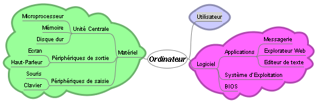
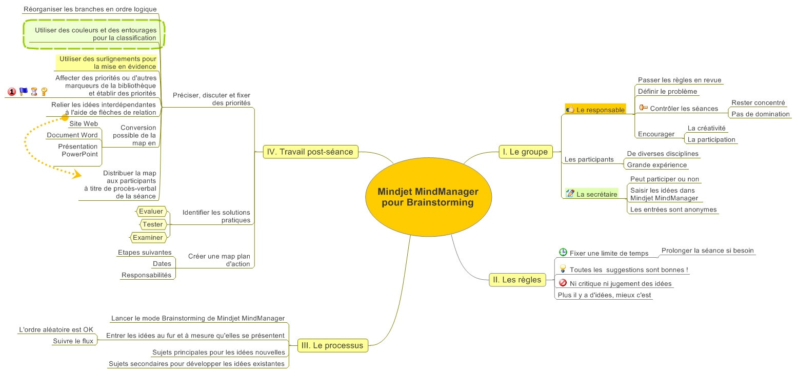
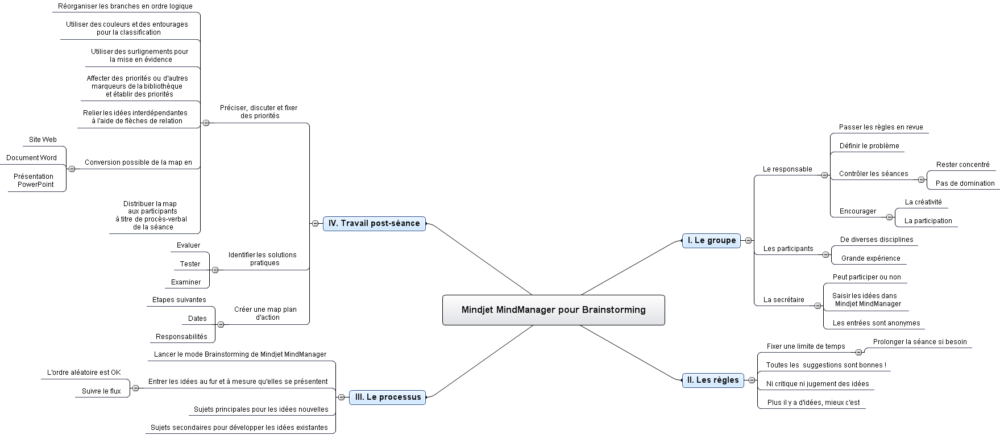
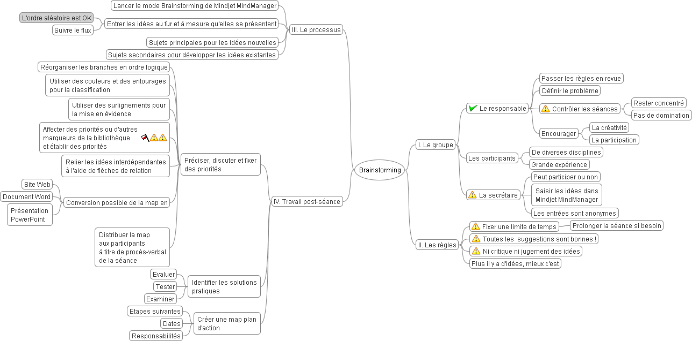

Les "mind maps" ou "[cartes heuristiques](w:carte_heuristique)" permettent de décrire des idées, concepts et autres informations plus ou moins abstraites sous forme graphique, sous forme arborescente en partant des éléments essentiels vers les détails.

On peut ainsi représenter les idées sortie d'un brainstorming, le cahier des charges d'un produit ou l'organisation d'un projet, mais aussi la structure hierarchique d'un produit, par exemple un ordinateur:

 On peut bien sur "mind mapper" avec un paper et un crayon, mais la gomme devient rapidement indispensable. Avec un ordinateur c'est encore mieux, on peut facilement réorganiser le graphique ou mettre certains points en évidence, mais on peut également utiliser des hyperliens pour faire correspondre des éléments de la mindmap à des sites web, des fichiers, voire des contacts, mails ou tâches dans Outlook ...

J'ai testé quelques logiciels de "mind mapping" pour trouver celui qui me convenait le mieux:

| "[Mind Manager", de MindPro.](https://www.mindjet.com/) Un produit facile d'utilisation et très complet. Il est un peu la référence dans ce domaine, ce qui se voit au fait que beaucoup d'autres produit sont capables de lire les fichiers ".mmap" de MindManager, ce qui me permet d'illustrer cet article avec la même carte MindManager vue dans les différents programmes | ") |
| --- | --- |
| ["Open Mind" de MatchWare](http://www.matchware.com/fr/products/mindview/default.htm) offre des fonctionnalités équivalentes, mais produit des cartes un peu moins jolies que MindManager. Par contre, OpenMind propose des fonctionnalités très intéressantes pour la gestion de projet : la représentation d'une mindmap sous forme de "timeline", un diagramme de Gantt en fait, et l'intégration avec MS Project | ") |
| [FreeMind](http://freemind.sourceforge.net/) a le grand avantage d'être gratuit. Il est tout aussi facile d'emploi que les logiciels commerciaux, et offre certaines fonctions avancées comme la gestion de revisions de la carte, très utile si on y travaille à plusieurs. Mais comme beaucoup de logiciels OpenSource, il n'est pas très copain avec les produits de Bill Gates. Par contre il sait exporter toutes sortes de formats XML : du XHTML en plusieurs variantes, du SVG et comme il peut utiliser unXSLT, on peut virtuellement exporter tous les formats imaginables. | ") |

Pour s'initier aux MindMaps, FreeMap me semble l'outil idéal. Pour une utilisation professionelle , je prendrais MindManager, sauf si vous utilisez intensivement MS Project, dans quel cas OpenMind  est une alternative à considérer.

A noter qu'il sera très bientôt possible de créer des MindMaps collaboratifs directement sur le web. Après les projets Myomi et Bubbl.us qui ont avorté, [MindMeister](http://www.mindmeister.com/) est en phase de test et semble très performant.
