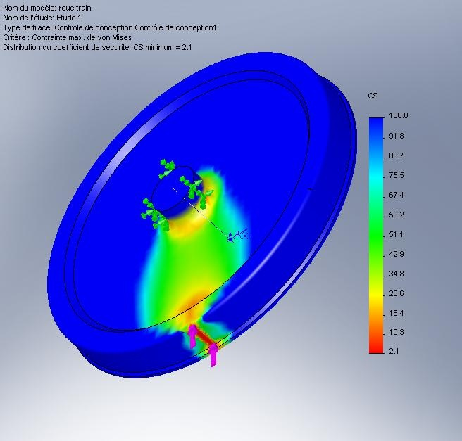
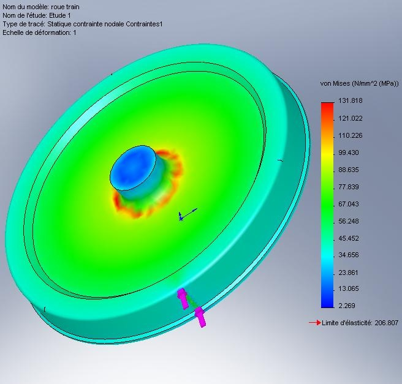
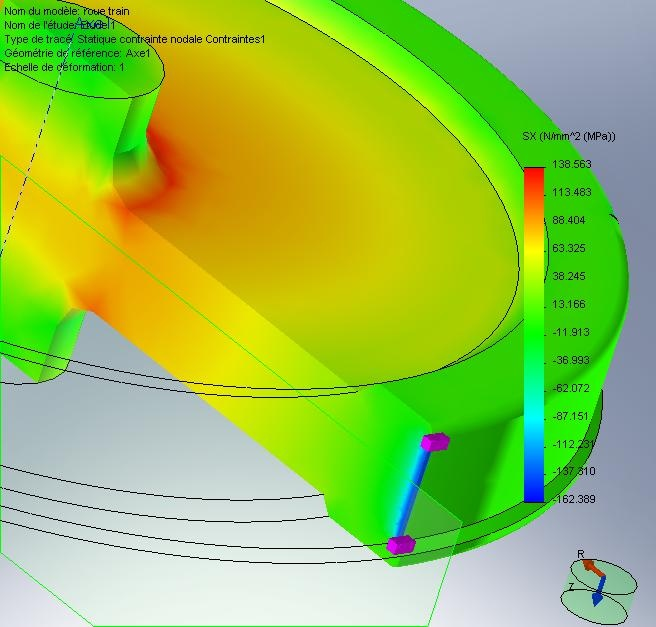

Le TGV a battu aujourd'hui son propre record de vitesse en atteignant presque 575 km/h, juste un peu moins que le Maglev japonais à sustentation magnétique (581 km/h). A la vitesse de 575 km/h, soit 160 m/s, une roue de 920 mm (pesant dans les 600 kg) fait 55 tours par seconde (!). Peut-elle tourner encore plus vite ?

J'ai rapidement modélisé une roue de train approximative en acier de construction standard avec SolidWorks et calculé avec CosmosWorks l'effet d'une charge de 12 tonnes correspondant environ au poids d'une motrice divisé par le nombre de ses roues. Le résultat à l'arrêt est ci-dessous : la contrainte au contact du rail est approximativement la moitié de la limite élastique de la roue :

A 55 tours par seconde, la force centrifuge change complètement la donne:

La contrainte due au contact avec le rail est à peine plus élevée que celle due à la force centrifuge (on parlera du signe plus bas) . Le coefficient de sécurité correspondant n'est plus que de 1.6 au lieu de 2.1 à l'arrêt : en fait la roue est plus près d'éclater à cause de sa vitesse que de s'écraser sous le poids de la loco !

Si on regarde ce qui se passe dans la zone de contact avec le rail, on voit que la contrainte est en compression (zone bleue) alors que dans toute la roue les contraintes sont en traction sous l'effet de la force centrifuge

La compression due aux 12 tonnes de poids du train est extrêmement localisée : à quelques millimètres de la zone de contact, c'est comme s'il n'y avait plus de rail. Chaque point du bandage de la roue passe 50 fois par seconde d'une forte traction à une forte compression et vice-versa en moins d'un millième de seconde : combinés avec les vibrations et les chocs, ce sont des conditions idéales pour la fatigue des matériaux...

Un facteur de sécurité de 2 sur les roues du TGV à 575 km/h est suffisant pour un record, mais pas pour un train censé rouler des heures par jour à cette vitesse. Si les trains commerciaux atteignent un jour cette vitesse, ils auront des roues très "high-tech", ou plus de roues du tout.
