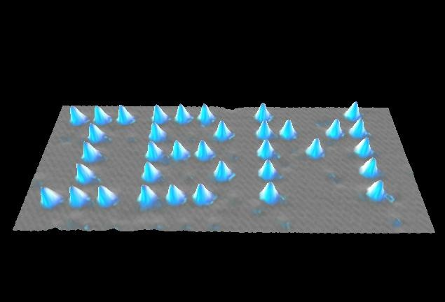
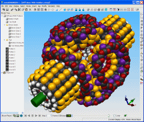
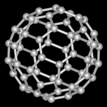
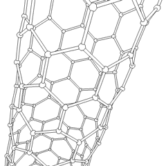

Après les mini-chaînes stéréo, les mini ordinateurs et les mini jupes, nous avons traversé l'ère du microprocesseur et de la microchirurgie, et voici déjà poindre la nanotechnologie. Pourquoi cette course à la miniaturisation et où s'arrêtera-t-elle ?

Suite à la lecture du roman "Prey" de Crichton [[2]](#ref-2), je me devais de faire le point sur ce sujet passionnant.

Aussi étonnant que çà puisse être, un objet miniature est proportionnellement plus solide, plus efficace, plus fiable, moins cher et plus économique que son original plus grand [[1]](#ref-1).

### Carré/Cube

Ceci peut s'expliquer facilement en mécanique par la loi dite "carré-cube", loi qui s'applique aussi à de nombreux autres domaines de la physique : si on divise par dix la dimension d'une pièce, son volume et donc son poids se réduit d'un facteur 1000 (le cube de 10) alors que sa surface totale et ses surfaces en contact avec d'autres pièces ne se réduisent que d'un facteur 100 (le carré de 10). Comme des forces 1000x plus faibles sont appliquées sur des surfaces 100x plus petites, l'objet miniature subit des contraintes mécaniques 10x plus faible, ou peut supporter des forces proportionnellement 10x plus grandes.

C'est ce qui explique qu'un éléphant risque la mort s'il tombe d'un mètre alors qu'une fourmi n'a rien a craindre d'une telle chute.

Pour la même raison, un mouvement de montre bracelet agrandi pour équiper une horloge de clocher ne fonctionnerait pas : les frottements sur les énormes rubis seraient trop élevés, et les axes plieraient sous le poids des roues.

Des raisonnements similaires expliquent pourquoi un microprocesseur contenant des millions de transistors sur quelques mm2 peut fonctionner beaucoup plus rapidement et de manière plus fiable qu'un circuit composés de gros transistors, ou pourquoi quelques atomes bien disposés produisent un meilleur rayon laser qu'un dispositif occupant une table.

### L'outillage

le seul vrai obstacle à la miniaturisation est l'outillage permettant la production de très petits composants. La fabrication d'une montre requiert nettement plus d'outils qu'elle ne comporte de pièces, à commencer par une bonne loupe et des doigts habiles. En électronique, des technologies issues de la photographie permettent de produire des circuits incroyablement complexes en alternant attaque chimique et déposition. On arrive même aujourd'hui à appliquer ces techniques à la mécanique pour produire des pièces en silicium ou de minuscules moules, donc des outils pour produire en série des pièces encore plus petites.

L'outil ultime de la miniaturisation est le [microscope à effet tunnel](w:), développé par une équipe d'IBM à Zürich et qui a valu le prix Nobel de physique à ses concepteurs. Non seulement il permet de distinguer chaque atome à la surface d'un objet, mis il permet dans certaines conditions d'arracher un atome à un endroit et de le déposer ailleurs. L'[équipe d'IBM](http://www.almaden.ibm.com/vis/stm/atomo.html) ainsi écrit les lettres IBM en déposant un à un 35 atomes de xenon (et pas 52) sur une surface de nickel

### [Nanotechnologie](w:)

Dans son article précurseur "[there is plenty of space at the bottom](/2009/06/11/il-y-a-plein-de-place-en-bas-2/)" que j'ai traduit en français, Richard Feynman expliquait en 1960 déjà qu'il était possible d'imaginer construire une voiture plus petite que ce point -> . Ce qui manquait à l'époque, c'était les outils pour le faire.

Or on peut désormais envisager la construction de "nano machines" constituées du nombre minimal d'atomes nécessaires à leur fonctionnement.Constituées de quelques centaines d'atomes, leur dimension de l'ordre du nanomètre, permettrait d'en aligner un million sur un milimètre! Il existe même des logiciels de CAO permettant de les concevoir, mais hélas aucune méthode rapide de les réaliser pour l'instant.

_nano-différentiel conçu avec Nano-Engineer-1 de [Nanorex](http://www.nanoengineer-1.com/content/) et simulé avec [Nano-Hive](http://www.nanohive-1.org/atHome/), un projet [BOINC](/2007/01/20/calcul-distribue-avec-boinc/)_

Une voie pourrait être la combinaison de procédés chimiques, biologiques et informatiques : la chimie devient capable de produire des nanomatériaux comme les "[fullerènes](w:Fullerène)", sphères de carbone dont la découverte a stupéfait le monde.

Actuellement, c'est la production de nanotubes de carbone qui fait l'actualité. Ce matériau incroyablement solide pourrait servir d'élément structurel à des nanomachines, mais peut être aussi concurrencer l'acier dans des applications macroscopiques. A l'autre extrême, on a réussi a construire des transistors "[CNFET](w:)" à nanotubes, qui permettent d'envisager à long terme la création de nano-circuits tridimensionnels ...

La biologie moléculaire est elle aussi capable désormais de faire produire des molécules organiques complexes par des bactéries, en reprogrammant leur ADN.

### "Prey"

Dans son thriller "Prey", Michael Crichton décrit l'apparition d'une forme de vie artificielle sous la forme d'un essaim de nanomachines volantes fabriquée par d'autres nanomachines "assembleuses"à partir de molécules organiques produites par des bactéries. Initialement conçues pour s'assembler sur commande pour former une camera, les machines sont dotées chacune d'un peu de mémoire et de puissance de calcul ce qui fait qu'un stock de plusieurs kilos de nanomachines, donc environ 10^30 cellules devient par la même occasion l'ordinateur le plus puissant du monde. Programmé pour s'auto-améliorer par des fondateurs de start-up trop pressés de devenir millionnaires pour faire le travail eux-mêmes, l'essaim devient rapidement capable de se reproduire et même assez intelligent pour se mettre à convertir la masse organique de ses créateurs en nanomachines...

### Références

1. Richard Feynman, "[there is plenty of space at the bottom](/2009/06/11/il-y-a-plein-de-place-en-bas-2/ "Il y a plein de place en bas")", 1960
2. 
