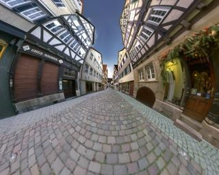

Relativity was discovered in 1905 by Albert Einstein and describes a world full of surpises and strange effects \[1\] which have not been exploited in movies or computer games so far.

Graphically, simulating fast moving spaceships or simply a world where light moves much slower than 300'000 km/s generates interesting visual effects:

- objects are deformed as in picture+movie below, which makes them harder to identify quickly [ (click on picture to see the movie)](http://www.spacetimetravel.org/filme/tue2/tue2.avi)
- their color is altered, enabling to visualize their speed
- the field of vision becomes restricted to the direction of displacement

Those effects can be viewed in "[Real Time Relativity](http://arxiv.org/ftp/physics/papers/0607/0607223.pdf)" \[1\], a PC software that lets you navigate in a scenery at relativistc speed.Even more interstingly, the "lag" induced by communication delays is a general problem that limits the geographic distance between players of a network game, but relativistic games might be designed to take advantage of the lag, and even make it artifically longer to make the game more interesting. Such games would rely on the player's ability to anticipate possible actions from other players rather than reacting to them.

Technically, relativistic visual effects can be computed in real time by modified "3D engines", while lag handling requires only memory buffers.

All you need now to create a very original video game based on relativity is a good gameplay...

References:

1. Craig M. Savage, Antony C. Searle, Lachlan McCalman, "[Real Time Relativity](http://arxiv.org/ftp/physics/papers/0607/0607223.pdf)". Department of Physics, Faculty of Science, The Australian National University. Interactive Program for PC using [GPGPU](http://gpgpu.org/) can be downloaded [here](http://www.anu.edu.au/Physics/Savage/RTR)
2. [D4 project at Uni Tuebingen](http://www.tat.physik.uni-tuebingen.de/~weiskopf/sr/index.html) with [list of publications](http://www.vis.uni-stuttgart.de/~weiskopf/publications/)
3. A.C. Searle, C.M. Savage, P.A. Altin, F.H. Bennet and M.R. Hush, Through Einstein’s Eyes, The Physicist, July/August 2005.. [Website](http://www.anu.edu.au/Physics/Savage/TEE/), [Backlight web site](http://www.anu.edu.au/Physics/Searle/), [Code development web site](http://sourceforge.net/projects/backlight)
4. C.M. Savage and A.C. Searle, [Visualising special relativity](http://www.anu.edu.au/Physics/Savage/publications.html#1999a), The Physicist, July/August 1999
5. D. Weiskopf, “[Visualization of four-dimensional spacetimes](http://www.vis.uni-stuttgart.de/forschung/wissenschaftliche-visualisierung/relativistische-visualisierung/reading.html)”, Ph.D. thesis, U. Tübingen (2001).
6. M. Bochers, “[Interactive and stereoscopic visualization in special relativity](http://tobias-lib.uni-tuebingen.de/dbt/volltexte/2005/1891/)”, Ph.D. thesis, U. Tübingen (2005).
7. U. Kraus, “[Through the city at nearly the speed of light](http://www.spacetimetravel.org/tuebingen/tuebingen.html)”: Featured on the cover of Physics Today 58, num. 1, Jan 2005.
8. [Philippe Guglielmetti,](http://www.cs.unc.edu/~zhangh/einstein.html) ["Accélération"](/2004/08/09/acceleration/), 2004, short novel (in french) describing a travel at relativistic speed to Barnard star
