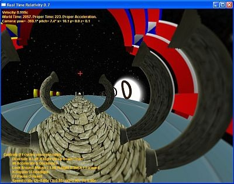

Un de mes vieux rêve est en train de se concrétiser : il devient possible de simuler des effets relativistes en temps réel, et donc d'[envisager faire des jeux basés sur la relativité](http://bids.wordpress.com/2007/05/02/relativistic-computer-game/) d'Albert.

Deux équipes sont bien avancées dans ce domaine :

1. [D. Weiskopf à l'Uni de Tubingen](https://publikationen.uni-tuebingen.de/xmlui/handle/10900/48159) a fait un vélo relativiste permettant de se promener dans les rues d'une ville ou la lumière se déplacerait à 30km/h au lieu de 300'000 km/s. Cette installation était à l'exposition Einstein de Berne en 2005, mais hors service quand j'y étais :-(
2. L'équipe australienne de Craig S. Savage a repris le flambeau de [Chris Betts](http://www.pegacat.com/cbetts/relpage.html) et a réalisé le "[Real Time Relativity](http://www.anu.edu.au/Physics/Savage/RTR/)", le premier simulateur relativiste pour PC. Il se manipule comme n'importe quel jeu video en 3D, mais utilise le processeur de la carte graphique (GPU) pour calculer les effets de la relativité (ça a l'air d'intéresser [JeGX](http://www.ozone3d.net/smf/index.php/topic,608.0.html)..)

