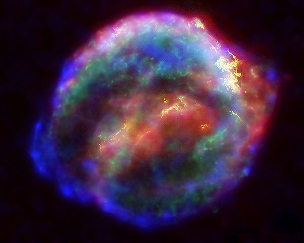

L'explosion d'étoile la plus violente jamais mesurée a été annoncée hier. Une géante rouge supermassive, 150 fois plus lourde que le Soleil a explosé dans la Galaxie NGC 1260, située à 240 millions d’années-lumière. La [supernova](w:) SN2006gy est devenue plus brillante que le noyau de cette galaxie, environ 50 millions de fois plus brillante que le Soleil pendant plus de 3 mois, et a ainsi battu le record de luminosité de toutes les supernovas enregistrés jusqu'ici. Plusieurs supernovas sont détectées chaque année dans les galaxies distantes, une poignée par millénaire seulement dans la Voie Lactée:

- [SN 185](w:) - observée par les Chinois
- [SN 1006](w: "SN 1006") - la plus brillante observée sur Terre durant les temps historiques.
- [SN 1054](w: "SN 1054") - ses restes forment la [Nébuleuse du Crabe](w: "Nébuleuse du Crabe")
- [SN 1181](w: "SN 1181") - moins connue
- [SN 1572](w: "SN 1572") - observée par [Tycho Brahé](w: "Tycho Brahé"), dont le livre _De Nova Stella_ sur le sujet donna le mot « nova »
- [SN 1604](http://fr.wikipedia.org/wiki/SN_1604 "SN 1604") - observée par [Johannes Kepler](w: "Johannes Kepler") (parfois appelée étoile de Kepler), c'est la dernière supernova à avoir été observée dans notre Galaxie

quelques autres depuis:

- [Cassiopeia A](w: "Cassiopeia A") a du exploser vers 1680 et aurait normalement pu être observée sur Terre. On ne sait pas pourquoi personne ne l'a vue.
- [SN 1885A](w: "SN 1885A") - visible à l'œil nu dans la [galaxie d'Andromède](http://fr.wikipedia.org/wiki/Galaxie_d%27Androm%C3%A8de "Galaxie d'Andromède") très voisine de la nôtre
- [SN 1987A](w:Supernova_1987A "Supernova 1987A") - observée dès le début dans le [Grand Nuage de Magellan](w: "Grand Nuage de Magellan").
- [SN 2006gy](http://fr.wikipedia.org/w/index.php?title=Supernova_SN_2006gy&action=edit "Supernova SN 2006gy") - décrite au début de cet article

La prochaine sera très probablement "Eta Carina" une géante rouge supermassive située dans [un coin de ciel très actif dont j'ai déjà parlé](/2007/04/25/nebula-carina/). Cette étoile crache de la matière depuis quelques années, signe qu'elle atteint la fin de sa courte vie (plus une étoile est grosse, plus elle brûle vite : les étoiles de cette taille ne vivent pas plus longtemps qu'un million d'années, contre des milliards pour notre petit Soleil) Les astronomes sont donc en train de braquer leurs instruments sur Eta Carina pour assister "bientôt" à ce qui pourrait devenir le plus fabuleux spectacle spatial de tous les temps. ("bientôt" c'est entre "demain" et "dans quelques siècles", mais probablement pas des millénaires)

Parce que j'ai gardé le meilleur pour la fin : Eta Carina n'est qu'à 7500 années lumières d'ici. Juste assez loin pour que son explosion soit bien visible la Terre, peut-être même plus lumineuse que le Soleil, mais pas assez près pour que nous soyons grillés par les particules émises et notre Soleil soufflé comme une bougie par l'onde de choc. Bonne nouvelle, non ?
