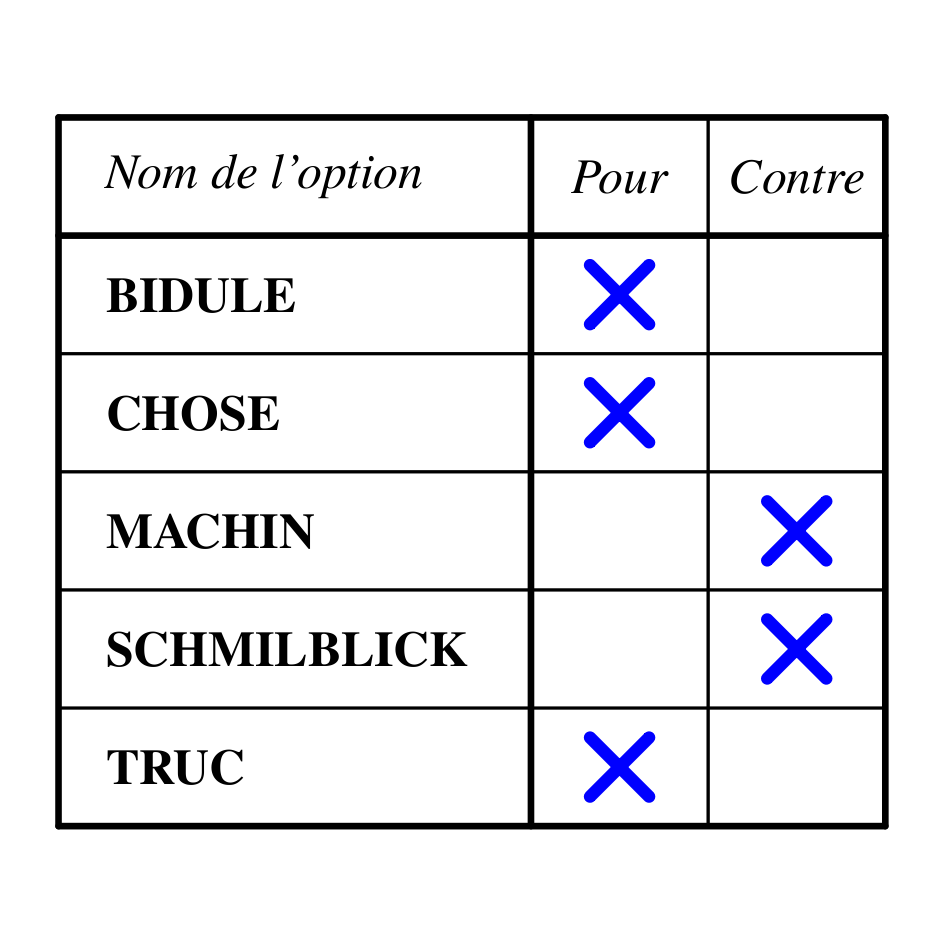

C'est la période des élections en France et bientôt en Suisse, et l'année prochaine les Etatzuniens remplaceront ce cher Bush. (cher comme les déficits qu'il était censé réduire).

Je ne vous dirai pas ici pour qui voter, mais je vais vous révéler l'importance décisive d'un élément qui se superpose aux idées, aux partis et aux candidats : le [système de vote](https://fr.wikipedia.org/wiki/système_de_vote), et faire de la pub pour un système de vote simple, juste et cependant utilisé (presque) nulle part : le "vote par assentiment".

Pour reprendre les exemples ci-dessus,

- beaucoup d'élections communales en Suisse se font par [scrutin proportionnel plurinominal](https://fr.wikipedia.org/wiki/scrutin_proportionnel_plurinominal) aussi appelé "vote de liste à la proportionnelle" : chaque électeur donne une voix au parti dont il utilise le bulletin, plus une voix à chaque candidat de la liste, avec la possibilité d'en tracer ou d'en ajouter d'autre partis. Ensuite on procède en deux phases :
    - on attribue à chaque parti un nombre "n" de sièges proportionnel au nombre de listes qu'il a recueilli
    - les "n" candidats du parti ayant reçu le plus de voix sont élus.Ce système a l'avantage de permettre à de petites formations minoritaires d'être représentées, mais il est de ce fait "injuste" puisqu'un membre d'une petite formation peut être élue avec un nombre de voix inférieur au score d'un candidat de grand parti qui serait le n+1ème de son parti.
- L'élection présidentielle française se fait au [scrutin majoritaire à deux tours](https://fr.wikipedia.org/wiki/scrutin_majoritaire_à_deux_tours) : les électeurs votent pour une seule personne parmi tous les candidats, et si aucun candidat n'obtient 50% des voix, on organise un second vote pour départager les 2 candidats ayant obtenu le plus de voix. A priori on est sur d'avoir un(e) Président(e) choisi(e) par la majorité des électeurs, mais comme on l'a vu il y a 5 ans, la présence de petits candidats peut complètement changer la situation au deuxième tour.
- L'élection du président des USA ne se fait pas au [scrutin majoritaire à un tour](https://fr.wikipedia.org/wiki/scrutin_majoritaire_à_un_tour) comme on pourrait le penser, mais à un système (unique?) d'[élection par "Grands Electeurs"](http://fr.wikipedia.org/wiki/%C3%89tats-Unis%2C_%C3%A9lection_pr%C3%A9sidentielle#L.27.C3.A9lection_du_pr.C3.A9sident_par_le_Coll.C3.A8ge_.C3.A9lectoral)qui revient en fait à un double scrutin majoritaire:
    
    1. Chaque Etat se voit attribuer un certain nombre de "Grands Electeurs", plus ou moins proportionnel à sa population.
    2. Chaque Etat donne alors toutes ses voix de "Grands Electeurs" au candidat ayant obtenu le plus grand nombre de voix dans cet Etat
    3. le candidat ayant obtenu le plus de voix de "Grands Electeurs" est élu
    
    Le président est donc élu à la majorité de la majorité, ce qui fait que:
    - ce n'est pas forcément le candidat ayant obtenu le plus de voix de citoyens qui gagne (Bush a reçu moins de voix qu' Al Gore en 2000)
    - encore plus que dans le système français, il n'est pas possible à un 3ème candidat d'émerger : il faudrait qu'il soit majoritaire dans plusieurs états pour être pris au sérieux.
    - la campagne se concentre sur les états susceptibles de changer de majorité, donc où les sondages sont très serrés. Il est inutile de perdre du temps dans les Etats qui sont acquis à un ou l'autre parti.
    - de ce fait, le découpage des circonscriptions électorales est très important : avec le même vote des citoyens, on obtient des résultats différents en fonction des limites des états...

Depuis longtemps les mathématiciens cherchent un système électoral qui soit simple et juste. Le [vote par assentiment, ou par approbation](https://fr.wikipedia.org/wiki/vote_par_approbation) est  si mathématiquement juste qu'il est utilisé justement pour l'élection des comités de mathématiciens, et si simple qu'il pourrait être utilisé facilement dans toutes les démocraties.

Le principe est que l'électeur coche sur une liste tous les candidats dont il approuverait l'élection. On a le droit de choisir autant de candidats qu'on veut, quel que soit le nombre de sièges à pourvoir. Sont élus les N candidats recevant le plus d'approbations. N peut valoir 1 pour une présidentielle, 20 pour un Conseil Communal ou 200 pour un Parlement, ça ne change rien : on est sur que les personnes les mieux acceptées par la population sont élues !

Trop simple, trop efficace, ne prenant pas en compte la notion historique mais de plus en plus dépassée de partis, ce système de vote presque parfait n'est utilisé nulle part encore...
