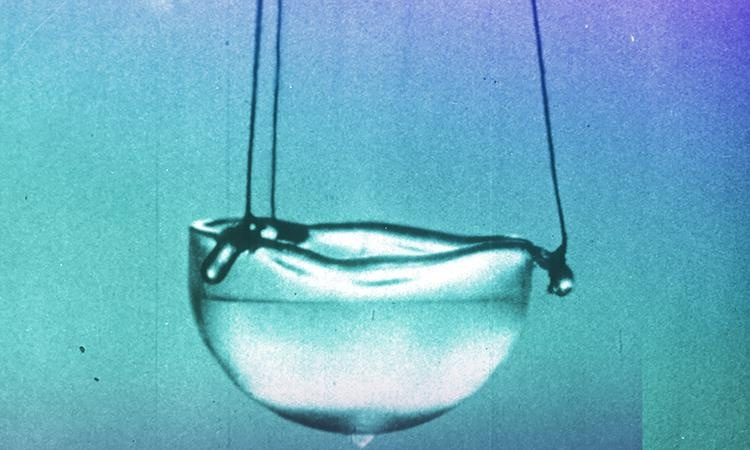

L'annonce du [refroidissement à moins de 2°K d'un bout du LHC](http://www.techno-science.net/?onglet=news&news=3853) m'a rappelé une anecdote sympa.

Alors que j'étais jeune assistant à l'Institut d'Automatique, un chercheur de l'Institut de Physique débarque en demandant un coup de main pour un problème de "régulation de température".  Le prof, pensant à un simple problème du genre thermostat de chauffage central l'envoie au débutant : moi.

Là le gars m'explique qu'il essaie de régler la température d'un récipient autour de 0.1 degré Kelvin (-273°, à peine au dessus du [zéro absolu](https://fr.wikipedia.org/wiki/zéro_absolu)...) ! Son [cryostat à dilution](https://fr.wikipedia.org/wiki/Réfrigérateur_à_dilution) utilise la différence de comportement de deux isotopes de l'hélium (He3 et He4)  à ces températures pour refroidir encore plus, par un phénomène que je n'ai toujours pas bien compris...

Bref, on discute un peu de la dynamique très spéciale de son système et de la méthode de réglage ad-hoc, puis on va manger un morceau et on discute un peu. Je lui demande ce qui l'intéresse dans le domaine de la cryogénie et là il me dit un truc génial :

> Depuis le Big-Bang qui était infiniment chaud, l'Univers se dilue et refroidit. Actuellement le vide spatial a la température du "rayonnement fossile" à 3°K, et aucun point de l'Univers ne peut être naturellement plus froid. **Donc les phénomènes comme la [superfluidité](https://fr.wikipedia.org/wiki/superfluide) de l'hélium n'ont jamais existé nulle part dans tout l'Univers, sauf dans les labos de cryogénie** **des êtres intelligents.**
