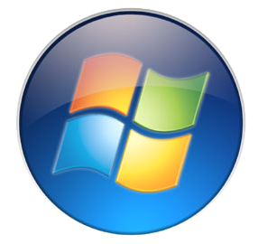
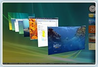

Je croyais que "Vista Diboli" signifait "J'ai vu le Diable" en latin, mais ce n'est que le titre d'un épisode de Tanguy et Laverdure qui se passe en Suisse et qui signifie "ennemi en visuel" en [code bambini](w:). Bon titre quand même donc.

Bref, je vais (enfin) vous donner mon avis sur le "nouveau" système d'exploitation" de Microsoft : Windows Vista.

<!--more-->En résumé, Vista c'est Windows XP en plus joli et plus paranoïaque.

"Windows XP", parce que toutes les promesses de nouveautés fondamentales comme [WinFS](w:) sont passées à la trappe, et l'interface utilisateur à laquelle je n'avais rien compris dans les versions Beta de Vista a laissé la place à un truc dans lequel tout utilisateur de Windows retrouve ses petits sans douleur.

"En plus joli", parce que que quand même, il fallait bien que Microsoft préserve sa réputation et continue à bouffer la moitié de la puissance de la machine pour son système. Avec des cartes graphiques puissantes et des processeurs multicoeurs, ça ouvre des perspectives : [Aero](http://windows.microsoft.com/fr-fr/windows-vista/products/features/productivity) fait s'illuminer les icônes quand la souris les survole, les fenêtres apparaissent avec un joli petit effet de zoom et peuvent même se mettre en travers pour faire un joli effet 3D totalement inutile. Dans le même temps, des trucs comme [BumpTop](http://bumptop.com/) vont beaucoup plus loin dans ce domaine.

"En plus paranoïaque" parce que les modifications internes de Vista par rapport à XP vont toutes dans le sens de la sécurisation du système. Sécurité est à prendre au sens large : Microsoft ne permet à plus personne de modifier le fonctionnement du coeur de Windows. Tout ce qui n'est pas signé Bill Gates tournera désormais en "user mode". Même les drivers des cartes graphiques n'ont dorénavant pas plus de droits qu'un programme normal.

Si cette parano ne touchait pas l'utilisateur, elle serait encore acceptable, mais la prise en main de Vista nous met le nez en plein dedans : chaque lancement de programme doit être re-confirmé "est-ce bien vous qui avez lancé le programme gnagnagna ?" alors qu'on vient de cliquer sur l'icône ! Rapidement insupportable de se faire chaperonner ainsi.

Côté compatibilité, rien à signaler : tous les programmes XP tournent sous Vista, et il n'y a pour l'instant pas vraiment de logiciels ne fonctionnant pas sous XP, marché oblige.

Bref, aucune raison de passer volontairement à Vista. Une mise à jour depuis Windows XP ne vous apportera aucun gain de productivité. Et pour vous en mettre plein les mirettes, n'importe quel jeu fera bien mieux que Aero. Si vous vous achetez un nouveau PC, vous n'aurez pas le choix : Vista sera dessus, ce sera bien assez tôt.
