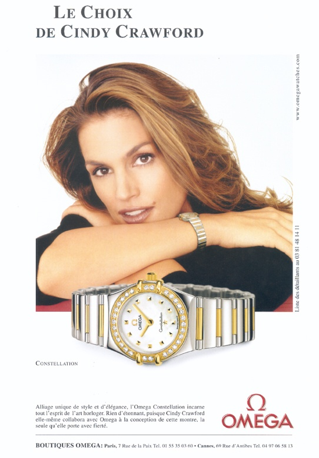

La réputation de l'horlogerie suisse s'est bâtie pendant plus d'un siècle autour de la légendaire "précision suisse" des montres mécaniques. Le Contrôle Officiel Suisse des Chronomètres ([COSC](http://www.cosc.ch/)) certifie comme "chronomètre" les montres variant de moins de 5 secondes par jour.

Imaginez la [crise de l'horlogerie suisse](http://www.ideesuisse.ch/247.0.html?&L=1) de la fin des années 1970 lorsque les mouvements à quartz coutant quelques francs ont permis une précision de 0.2 secondes par jour, et que quelques lignes de programme dans un microprocesseur ont permis de réaliser les fonctions des plus délicates [complications](http://www.horlogerie-suisse.com/Complications/accueil.htm) mécaniques.

Comment l'horlogerie suisse est-elle parvenue, non seulement à survivre, mais à se développer d'une façon spectaculaire en vendant des produits basés sur une technologie dépassée ?

En pensant différemment. L'homme qui a ainsi sauvé l'horlogerie suisse s'appelle [Nicolas Hayek](w:). Il a même pensé différemment au moins 3 fois:

1. en lançant [l'aventure Swatch](http://www.worldtempus.com/fr/encyclopedie/index-encyclopedique/histoire-de-lhorlogerie/le-phenomene-swatch/lextraordinaire-aventure-swatch/)
2. en engageant [Cindy Crawford](http://www.omegawatches.com/ambassadors/cindy-crawford)
3. en ne vendant plus d'ébauches ETA

### L'aventure Swatch

En 1983, les premières montres [Swatch](http://www.swatch.com/) sont en plastique, à quartz, et très bon marché grâce à une production très automatisée, mais toujours à aiguilles.

Mais le coup de génie c'est le marketing. Les Swatches sont de toutes les couleurs, de plus en plus fun et on en achète plusieurs alors que pour avoir l'heure une suffirait. Des collectionneurs achètent tous les modèles qui sortent. Swatch se met à produire des séries limitées de certaines montres dessinées par des designers célèbres. Toujours en plastique, elles atteignent le prix de montres en or massif.



Puis Swatch se mit se proposer des montres "sans pile", présentant les bons vieux mouvements mécaniques comme une innovation auprès des jeunes ! La précision devient totalement secondaire, d'autant que lorsqu'on possède 10 montres à quartz, il faut pratiquement changer la pile chaque fois qu'on souhaite en porter une autre et la remettre à l'heure de toutes façons.

Le prix des Swatches augmente lentement mais surement, et rejoint même parfois celui des autres marques qu'Hayek rallie à son groupe SMH, comme Omega et Breguet.

Des montres comme la "[Diaphane One Turning Gold](http://horlogerie.wordpress.com/2007/05/14/diaphane-one-turning-gold/)" illustrent l'incroyable évolution de Swatch et d'autres marques suisses : après avoir produit des montres précises en grandes quantités, la Suisse produit maintenant une multitude de modèles d'objets de luxe "Made In switzerland" produits en petite série et dont la fonction "donner l'heure" est devenue presque accessoire

### Cindy Crawford

La montre est pratiquement le seul "bijou pour homme", ou objet de luxe masculin. Les femmes ont des bracelets, des colliers, des boucles d'oreilles, de belles robes et chaussures. Pourquoi achèteraient-elles en plus des montres ?

Hayek est le premier a avoir ciblé le marketing des montres sur les femmes, en engageant Cindy Crawford comme "ambassadrice d'Omega" dès 1995, et réussissant ce que certains de ces concurrents pensaient impossible : vendre 50% de montres féminines.

Mais les horlogers se heurtent à une difficulté en concevant des montres mécaniques pour dames: elles sont trop petites pour y installer un mouvement automatique, et le barillet est trop petit pour permettre une réserve de marche suffisante : il faut les remonter tout le temps. Comment faire ? Augmenter la taille des montres ! Si les hommes se mettent à porter des montres énormes, les femmes pourront porter des montres plus grandes...

### Les ébauches ETA

ETA est une filiale du groupe Swatch qui produit des mouvements mécaniques revendus à toute l'industrie horlogère suisse, et aussi des "ébauches", des parties vitales de ces mouvements. En 2002, Hayek annonça qu'ETA ne vendrait plus d'ébauches, mais seulement des mouvements complets à ses clients dès 2006. Ceci fit [grand bruit](http://journal.hautehorlogerie.org/fr/echos/au-coeur-des-marches/la-production-horlogere-suisse-a-un-tournant-1897/), mais il me semble qu'il a ainsi rendu un énorme service à l'horlogerie pour la troisième fois.

En effet, peu de marques créaient leurs propres mouvements. La plupart se "limitaient" à intégrer des mouvements ETA ou à les personnaliser à partir d'ébauches. Après l'annonce de 2002, beaucoup de marques ont, de gré ou de force, compris la nécessité d'investir et d'innover aussi dans ce domaine. Depuis, un foisonnement de nouveautés mécaniques se combine avec les créations des designers pour produire une variété encore plus incroyable de montres de plus en plus spéciales, alimentant la croissance de ce secteur et contribuant au démarrage de nombreuses petites entreprises.

Bravo et Merci, Monsieur Hayek !
