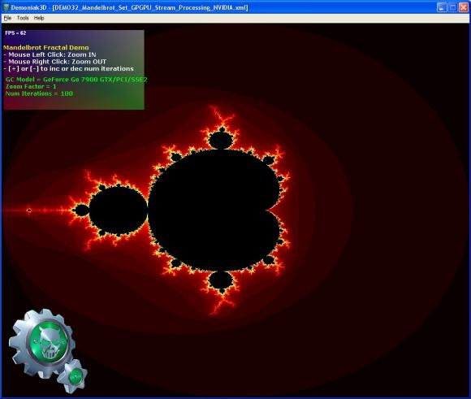

Dans votre ordinateur, il y a un CPU (Central Processing Unit) de chez Intel ou AMD communément appelé "processeur", et un GPU (Graphics Processing Unit) de chez nVidia ou ATI. Il n'y a pas si longtemps, le GPU était un circuit "fermé", non programmable par le commun des mortels, entièrement dédié à la production de belles images sur votre écran. Depuis quelques années, ces circuits sont devenus programmables pour permettre de produire de très beaux effets graphiques, et leur puissance à augmenté, augmenté... A tel point qu'aujourd'hui, votre GPU contient probablement plus de transistors que votre CPU, et est certainement capable de résoudre certains problèmes plus rapidement !<!--more-->

Alors qu'un CPU a maintenant 2 coeurs capables d'exécuter chacun quelques dizaines de tâches complexes en (quasi-) parallèle, un GPU peut exécuter un petit programme appelé "shader" pour chaque point de l'écran (presque) en même temps, soit traiter des milliers de données (presque) simultanément. Pour autant qu'un problème puisse être ramené à celui de petits points "intelligents" qui ne parlent et écoutent que leurs voisins immédiats, le GPU va le résoudre bien plus vite que le CPU.

Quelques exemples:

1. la [fractale de Mandelbrot](http://www.ozone3d.net/demos_projects/mandelbrot_set.php), déjà mentionné dans l'article sur [Hyperion](/2007/03/25/hyperion-3d/), mais on reste dans le monde de l'inutile beauté des mathématiques.
2. [Real Time Relativity](http://www.anu.edu.au/Physics/Savage/RTR/), déjà mentionné [ici,](/2007/05/02/relativite-en-temps-reel-2/) qui combine la fonction principale d'une carte graphique, représenter une scène en 3D, avec des calculs relativistes nécessitant 4 dimensions grâce au fait que les GPU traitent 4 composantes de couleur RGBA (Rouge, Gert, Bleu, trAnspArent)
3. Et là je viens de tomber sur plusieurs références expliquant comment simuler la gravitation entre N corps avec un GPU, ce qui permet de simuler une mini galaxie de 8192 étoiles beaucoup plus vite qu'avec un CPU:
    - Mark Harris "Mapping Computational Concepts to GPUs", nVidia ([ppt](http://gpgpu.org/s2005/slides/harris.Mapping.ppt))
    - Francisco Chinchilla, Todd Gamblin, Morten Sommervoll "Parallel N-Body Simulation using GPUs ([word](http://wwwx.cs.unc.edu/~tgamblin/gpgp/GPGPfinalReport.doc))
    - L. Nyland, M. Harris, and J. Prins, “N-body simulations on a GPU,” in Proc of the ACM Workshop on General-Purpose Computation on Graphics Processors, 2004.
    - Tsuyoshi Hamada, Toshiaki Iitaka, "The Chamomile Scheme: An Optimized Algorithm for N-body simulations on Programmable Graphics Processing Units" , 2007 ([pdf](http://arxiv.org/PS_cache/astro-ph/pdf/0703/0703100v1.pdf))

Pour rester au courant sur ce sujet, suivre le site de référence [GPGPU.org](http://gpgpu.org) (General-Purpose Computation Using Graphics Hardware)

Tout ceci et la récente fusion d'AMD (CPU) et d'ATI (GPU) fait penser que les prochains processeurs combineront peut-être les avantages respectifs des CPU et des GPU. Peut-être en coupant la poire en deux en faisant beaucoup de coeurs simples, comme dans le "Cell" d'IBM qui trône dans les PlayStation 3 ? Il faudra encore apprendre à programmer ce genre de puces pour en tirer toute la puissance...
