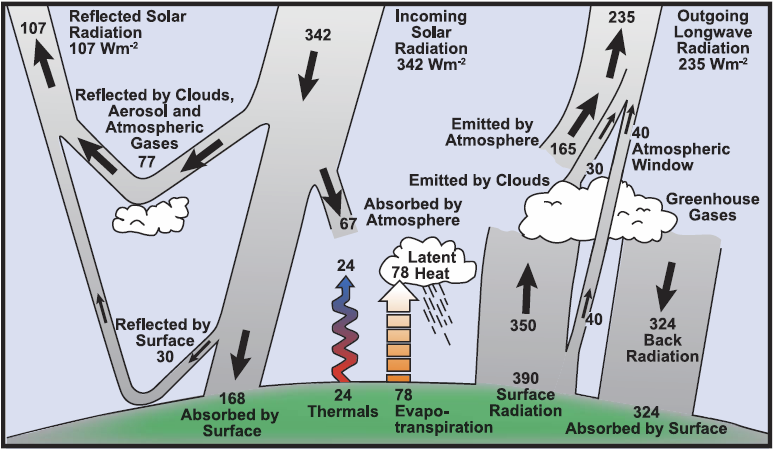
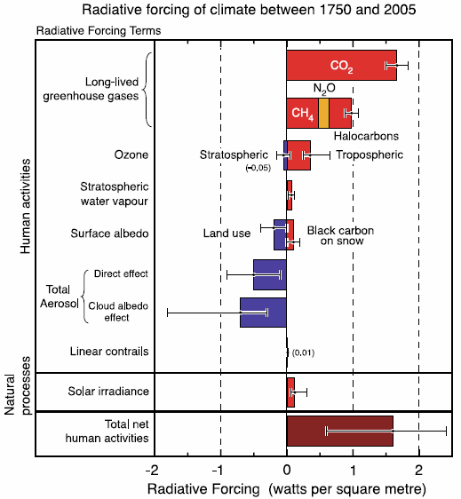
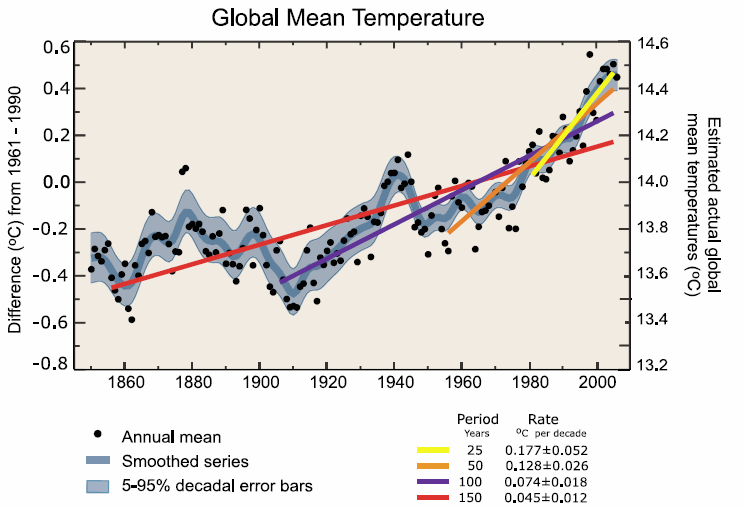
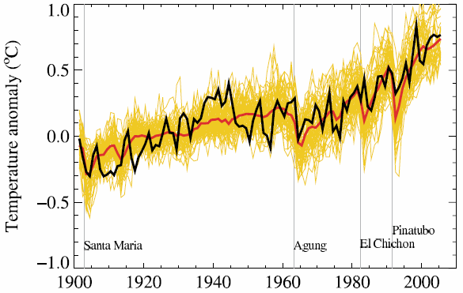
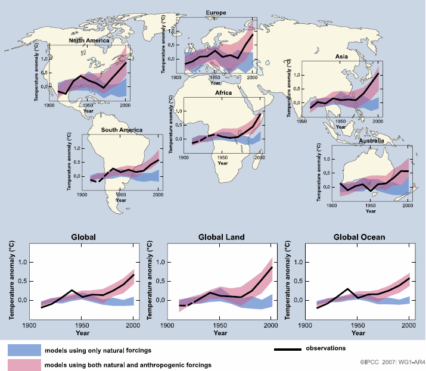

Le site [RealClimate](http://www.realclimate.org/) aborde la "climatologie par les scientifiques du climat" et est l'un des plus sérieux sur le sujet. Leur page [Start here](http://www.realclimate.org/index.php/archives/2007/05/start-here/) dirige vers des sources d'information pour public plus ou moins averti, mais en anglais évidemment.

Mais il est vrai que la FAQ (Frequently Asked Questions) de l'IPCC AR4 ([disponible en pdf](https://www.ipcc.ch/pdf/assessment-report/ar4/wg1/ar4-wg1-faqs.pdf), et bientôt en html) est excellente et couvre les questions fondamentales que j'ai traduites pour vous, avec un hyper résumé des réponses de la FAQ, mais surtout leurs très beaux graphiques:

1. Quels facteurs déterminent le climat de la Terre? tout revient à un bilan énergiétique représenté dans cette figure: 
2. Quelle est la relation entre changement climatique et météo?
3. Qu'est-ce que l'effet de serre?
4. Comment les activités humaines contribuent-elle au changement climatique par rapport aux phénomènes naturels?
    - l'activité humaine a modifié le bilan énergétique (voir ci-dessus) en accroissant l'apport d'énergie de 0.6 à 2.4 W/m2 entre 1750 et 2005
    - les phénomènes naturels ont aussi accru l'énergie, entre 0.1 et 0.3 W/m2, soit grosso-modo 10x moins
5. Comment les températures changent-elles? de plus en plus vite : 
6. Comment les précipitations changent-elles ?
7. Y'a-t-il eu un changement sur les évènements extrêmes comme les canicules, les sécheresses, inondations et ouragans ?
8. La quantité de neige et de glace sur Terre diminue-t-elle? Oui.
9. Le niveau des mers monte-t-il? Oui et de plus en plus vite. De 1870 à 2005, les mers sont montées de 20cm environ. La moyenne pour de XXIème siècle est de 1.7 mm/an, mais les mesures par satellite effectuées depuis 1983 donnent 3mm/an. A noter que cette hausse n'est que très peu due à la fonte des glaces : c'est surtout la dilatation de l'eau qui se chauffe un peu qui cause l'élévation du niveau des océans.
10. Qu'est-ce qui causa les glaciations et les autres changements climatiques importants avant l'ère industrielle?
11. Le changement climatique est il inhabituel comparé aux autres changements historiques? par certains aspects oui, par d'autres non:
     - la températures moyenne n'a jamais été aussi haute depuis au moins 500 ans, probablement 1000.
     - mais la vitesse du changement est telle que s'il persiste encore un siècle, le réchauffement sera un évènement exceptionnel dans l'histoire de la Terre.
     - la concentration de CO2 dans l'atmosphère n'a jamais été aussi haute depuis 500'000 ans
     - pour trouver une preuve de climat plus chaud avec un niveau des mers plus élevés, il faut remonter à 3'000'000 d'années...
12. L'augmentation du CO2 et des autres gaz a effet de serre pendant l'ère industrielle est-il du aux activités humaines? Oui, il n'y a aucun doute là dessus. L'activité volcanique a été évaluée grâce à l'étude des isotopes du carbone dans le CO2 atmosphérique : elle est négligeable comparée à l'activité humaine. Pour le méthane, l'écart est moins clair, mais il semble quand même que l'activité humaine est dominante.
13. Quelle est la fiabilité des modèles utilisés pour faire des projections du changement climatique futur ? c'est ce que j'ai trouvé le plus intéressant : elle est très bonne comme le montre le graphique suivant:  Les 58 courbes jaunes correspondent à différentes méthodes de simulation testées sur le XXème siècle : on leur demande de calculer le climat du XXème siècle en n'utilisant que des données d'avant 1900 (sinon ce serait de la triche...). La courbe rouge est la moyenne des 58 simulations et la noire correspond aux mesures réelles. Comme ça correspond bien, on se dit que le modèle est bon et peut être utilisé valablement pour prédire l'avenir
14. Des évènements extrêmes spécifiques peuvent-ils être expliqués par le réchauffement global ?
15. Le réchauffement du XXème siècle peut-il être expliqué par des variations naturelles? C'est extrêmement improbable. Les simulations (voir ci-dessus) montrent que les résultats mesurés ne "collent pas" si l'on ne simule que les phénomènes naturels (bleu), mais collent très bien en considérant l'activité humaine (rouge), et ceci dans toutes les régions du monde, sur terre et sur mer :
16. Les évènements extrêmes comme les canicules, les sécheresses, inondations et ouragans vont-ils changer si le climat change?
17. Quelle est la probabilité de changements majeurs ou abrupts tel que la fonte des calottes polaires ou un changement de la circulation océanique? ces évènements ne se produiront probablement pas pendant le XXIème siècle, mais pourraient se produire si le réchauffement se poursuit.
18. Si les émissions de gaz à effet de serre sont réduites, à quelle vitesse leur concentration dans l'atmosphère va-t-elle décroitre ?
19. Les changements climatiques prévus vont-ils varier de région en région?

voir aussi la page ["Réchauffement climatique" de la Wikipedia](w:Réchauffement_climatique)
