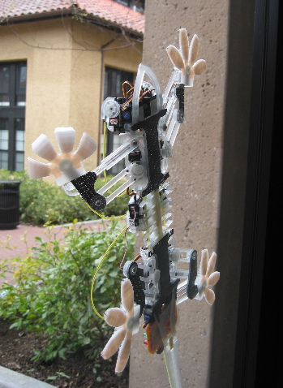

Ils l'on fait : un robot capable de grimper sur du verre en utilisant la force de Van der Waals.

\[youtube odAifbpDbhs\] 

Le [SkickyBot de l'université de Stanford](http://www.stanford.edu/~sangbae/Stickybot.htm) imite le gecko, dont on a compris comment les pattes fonctionnaient qu'en 2002.

Depuis, il a été possible de créer des matériaux adhésifs sur le même principe. Spiderman n'est plus très loin. En attendant, une équipe de Carnegie Mellon a fait un robot moins joli, mais plus rapide et capable de marcher au plafond !

Références:

1. [Techno Science : Marcher sur les murs: le gecko au secours de la technologie](http://www.techno-science.net/?onglet=news&news=4098)
2. ["Van de Waals force" sur Wikipedia](http://en.wikipedia.org/wiki/Van_der_Waals_force) (en anglais, la version française est totalement indigeste)
