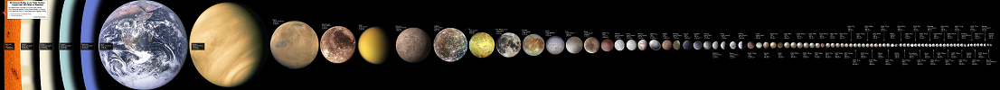

Sur ce beau poster on peut voir [tous les objets (connus) du Système solaire d'un diamètre plus grand que 350 km](http://kokogiak.com/solarsystembodieslargerthan200miles.html)

 *(cliquer dessus et patienter pour une image 10x plus grande...)*

Entre autres, on comprend mieux que le statut de planète de Pluton ait été contesté : notre Lune + 6 lunes de Jupiter et de Saturne sont nettement plus grosses.
