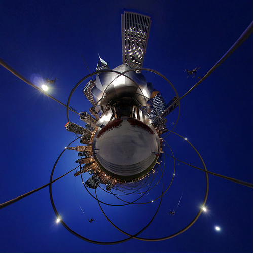
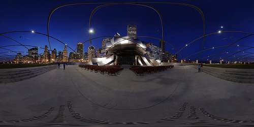

Et encore un autre photographe de génie trouvé sur Flickr : Sam Rohn enroule des panoramas photographiés sur 360°, ce qui donne ça:

à partir d'un panorama du Millenium Park de Chigaco, avec le Pavillon Pritzker de Franck Gehri:

il y a [d'autres "planetoids" dans ce genre ici](http://www.flickr.com/photos/nylocations/sets/72157594458664177/), notamment certains faits à Jerusalem qui sont magnifiques.
