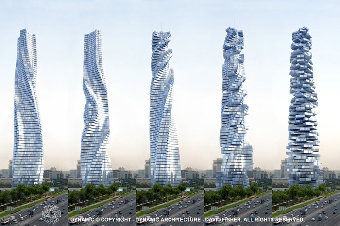

La dernière folie d'architecte qui va être construite à Dubai : une tour dont chaque étage peut tourner sur 360° ! La création "[DYNAMIC ARCHITECTURE](http://www.dynamicarchitecture.net/)" de David Fisher pourra ressembler à ça dans la même journée:

et la vidéo suivante présente l'ensemble du projet :



Je n'ai pas trouvé d'info sur le prix et le délai, mais à Dubai ça n'a pas d'importance... (merci a Mehri pour l'info)
